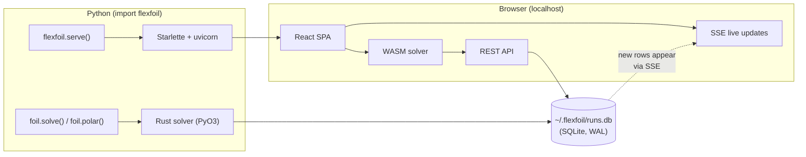

# Python API

The `flexfoil` Python package wraps the RustFoil solver in native bindings via
[PyO3](https://pyo3.rs). Every solve is cached in a local SQLite database
(`~/.flexfoil/runs.db`). The same web UI from
[foil.flexcompute.com](https://foil.flexcompute.com/flexfoil/) can be launched
locally with `flexfoil.serve()`, reading from the same database.

**No data leaves your machine** unless you explicitly export it.

## Install

```bash
pip install flexfoil
```

Pre-built wheels are available for macOS (Apple Silicon and Intel), Linux x86\_64,
and Windows x86\_64. Plotly is included by default for interactive plots.

Optional extras:

```bash
pip install "flexfoil[all]"        # server + matplotlib + pandas
pip install "flexfoil[matplotlib]" # matplotlib for polar.plot(backend="matplotlib")
pip install "flexfoil[dataframe]"  # pandas for polar.to_dataframe()
pip install "flexfoil[server]"     # starlette + uvicorn for flexfoil.serve()
```

## Quick start

### Single-point solve

```python
import flexfoil

foil = flexfoil.naca("2412")
result = foil.solve(alpha=5.0, Re=1e6)

print(result.cl)          # 0.8094
print(result.cd)          # 0.00775
print(result.cm)          # -0.0540
print(result.converged)   # True
print(result.ld)          # 104.5
print(result.x_tr_upper)  # 0.315  (transition location, upper surface)
```

### Polar sweep

Polar sweeps are **parallelized by default** using all available CPU cores
(via Rust's rayon thread pool). A 41-point polar runs ~3x faster than sequential.

```python
polar = foil.polar(alpha=(-5, 15, 0.5), Re=1e6)
print(polar)
# PolarResult('NACA 2412', Re=1e+06, 40/41 converged, CLmax=1.4523, α_stall=12.5°, L/D_max=78.3)

# Aggregate statistics
polar.cl_max         # 1.4523
polar.alpha_stall    # 12.5
polar.ld_max         # 78.3
polar.cd_min         # 0.00523
polar.summary()      # dict with all aggregate statistics

# Generic aggregation with optional outlier filtering
polar.column_max('cl', filter_outliers=True)
polar.argmax('ld', 'alpha')   # alpha at max L/D
polar.argmin('cd', 'alpha')   # alpha at min CD

# Interactive plotly figure (default): CL-α, CD-α, CL-CD, CM-α
polar.plot()

# Or use matplotlib
polar.plot(backend="matplotlib")

# Sequential mode (for debugging or progress output)
polar = foil.polar(alpha=(-5, 15, 0.5), Re=1e6, parallel=False)

# Export to pandas (with summary statistics in df.attrs)
df = polar.to_dataframe(summary=True)
df.to_csv("polar.csv", index=False)
```

### Compare multiple airfoils

```python
import plotly.graph_objects as go
import flexfoil

fig = go.Figure()
for naca in ["0012", "2412", "4412"]:
    foil = flexfoil.naca(naca)
    polar = foil.polar(alpha=(-4, 14, 1.0), Re=1e6)
    fig.add_trace(go.Scatter(
        x=polar.alpha, y=polar.cl,
        mode="lines+markers", name=foil.name,
    ))

fig.update_layout(
    xaxis_title="α (°)", yaxis_title="CL",
    template="plotly_white",
)
fig.show()
```

### Load a .dat file

```python
foil = flexfoil.load("e387.dat")   # Selig or Lednicer format
result = foil.solve(alpha=4.0, Re=2e5)
```

### Custom coordinates

```python
foil = flexfoil.from_coordinates(x_list, y_list, name="my shape")
result = foil.solve(alpha=3.0, Re=1e6)
```

### Flap deflection

```python
flapped = foil.with_flap(hinge_x=0.75, deflection=10)
print(flapped)
# Airfoil('NACA 2412 +flap(75%, +10.0°)', n_panels=160)

result = flapped.solve(alpha=5.0, Re=1e6)
print(result.cl)  # ~1.27 (vs 0.81 clean)

# Sweep flap deflections
for defl in [0, 5, 10, 15]:
    f = foil.with_flap(hinge_x=0.75, deflection=defl)
    polar = f.polar(alpha=(-4, 14, 1.0), Re=1e6)
```

### Variable-Reynolds modes (Type 2 & 3)

XFOIL supports three Reynolds number constraint types for polar sweeps.
Pass `re_type=` to `solve()` or `polar()`:

| Mode | Constraint | Effective Re | Use case |
| --- | --- | --- | --- |
| 1 (default) | Constant Re | Re | Standard wind-tunnel polar |
| 2 | Fixed Re·√CL | Re / √\|CL\| | Aircraft cruise (lift = weight) |
| 3 | Fixed Re·CL | Re / \|CL\| | Propeller / turbomachinery blades |

```python
# Mode 2: as CL changes, speed adjusts → effective Re varies
result = foil.solve(alpha=5.0, Re=1e6, re_type=2)
print(result.reynolds_eff)  # effective Re after Mode 2 adjustment

# Full polar with variable Re
polar = foil.polar(alpha=(-5, 15, 0.5), Re=1e6, re_type=2)
```

### Inviscid analysis

```python
result = foil.solve(alpha=5.0, viscous=False)
# result.cd == 0.0 (no drag in potential flow)
```

## Launch the web UI

```python
flexfoil.serve()
# Opens the full flexfoil web app in your browser.
# Defaults to port 8420; automatically picks the next free port if busy.
```

Or from the command line:

```bash
flexfoil serve
flexfoil serve --port 9000 --no-browser
```

The web UI reads from the same local SQLite database as the Python API. Runs
solved from the browser (via the built-in WASM solver) are also written to the
shared database, so `flexfoil.runs()` in Python sees them and vice versa.

## Query the run database

Every solve (from Python or the web UI) is cached in `~/.flexfoil/runs.db`.

```python
df = flexfoil.runs()
print(f"{len(df)} runs cached")

naca_runs = df[df.airfoil_name == "NACA 2412"]
```

## CLI

```bash
flexfoil solve 2412 -a 5 -r 1e6    # quick solve from the terminal
flexfoil serve                       # launch the web UI
flexfoil info                        # show config and DB location
```

## Architecture



The Rust solver called from Python is the exact same code as the WASM solver
in the browser — both are compiled from the `rustfoil-xfoil` crate. Results
are byte-identical.

## API reference

### Top-level functions

| Function | Description |
| --- | --- |
| `flexfoil.naca(designation, n_panels=160)` | Create airfoil from NACA 4-digit string |
| `flexfoil.load(path, n_panels=160)` | Load from `.dat` file |
| `flexfoil.from_coordinates(x, y, name, n_panels)` | Create from raw x/y arrays |
| `flexfoil.runs()` | All cached runs (DataFrame or list) |
| `flexfoil.serve(port, host, open_browser)` | Launch local web UI + API server |
| `flexfoil.get_database(path=None)` | Get or create a `RunDatabase` |

### Airfoil

| Property / Method | Description |
| --- | --- |
| `.name` | Airfoil name |
| `.n_panels` | Number of panel nodes |
| `.raw_coords` | Original coordinates `list[(x, y)]` |
| `.panel_coords` | Repaneled coordinates `list[(x, y)]` |
| `.hash` | SHA-256 hash of panel coords (cache key) |
| `.with_flap(hinge_x, deflection, hinge_y_frac, n_panels)` | Return new Airfoil with flap deflected |
| `.solve(alpha, Re, mach, ncrit, max_iter, viscous, store, re_type)` | Single-point analysis (`re_type`: 1, 2, or 3) |
| `.polar(alpha, Re, mach, ncrit, max_iter, viscous, store, parallel, re_type)` | Sweep over alpha range (parallel by default) |
| `.bl_distribution(alpha, Re, mach, ncrit, max_iter, re_type)` | Boundary-layer distribution at a single alpha |

### SolveResult

| Field | Type | Description |
| --- | --- | --- |
| `.cl` | `float` | Lift coefficient |
| `.cd` | `float` | Drag coefficient |
| `.cm` | `float` | Moment coefficient (quarter-chord) |
| `.converged` | `bool` | Whether the Newton solve converged |
| `.iterations` | `int` | Newton iterations used |
| `.residual` | `float` | Final Newton residual |
| `.x_tr_upper` | `float` | Transition x/c, upper surface |
| `.x_tr_lower` | `float` | Transition x/c, lower surface |
| `.alpha` | `float` | Angle of attack (degrees) |
| `.reynolds` | `float` | Reynolds number (nominal) |
| `.reynolds_eff` | `float \| None` | Effective Reynolds after Mode 2/3 adjustment |
| `.mach` | `float` | Mach number |
| `.ncrit` | `float` | e^N transition criterion |
| `.ld` | `float \| None` | Lift-to-drag ratio |
| `.success` | `bool` | Overall success flag |
| `.error` | `str \| None` | Error message if failed |

### PolarResult

| Property / Method | Description |
| --- | --- |
| `.alpha` | `list[float]` — angles (converged only) |
| `.cl` | `list[float]` — lift coefficients |
| `.cd` | `list[float]` — drag coefficients |
| `.cm` | `list[float]` — moment coefficients |
| `.ld` | `list[float]` — lift-to-drag ratios |
| `.converged` | `list[SolveResult]` — converged results only |
| `.results` | `list[SolveResult]` — all results |
| `.cl_max` | `float \| None` — maximum CL |
| `.cl_min` | `float \| None` — minimum CL |
| `.cd_min` | `float \| None` — minimum CD |
| `.ld_max` | `float \| None` — maximum L/D |
| `.alpha_stall` | `float \| None` — alpha at CL_max |
| `.alpha_at_ld_max` | `float \| None` — alpha at L/D_max |
| `.alpha_at_cd_min` | `float \| None` — alpha at CD_min |
| `.column_max(col, filter_outliers=False)` | Max of any column |
| `.column_min(col, filter_outliers=False)` | Min of any column |
| `.column_mean(col, filter_outliers=False)` | Mean of any column |
| `.column_median(col, filter_outliers=False)` | Median of any column |
| `.column_stdev(col, filter_outliers=False)` | Std deviation of any column |
| `.argmax(target, return_col, filter_outliers=False)` | Value of *return_col* at max of *target* |
| `.argmin(target, return_col, filter_outliers=False)` | Value of *return_col* at min of *target* |
| `.summary()` | Dict of all aggregate statistics |
| `.to_dict(summary=False)` | Export as `dict` (optionally include summary) |
| `.to_dataframe(summary=False)` | Export as `pandas.DataFrame` (summary in `.attrs`) |
| `.plot(show=True, backend="plotly")` | 4-panel figure (plotly default, or `"matplotlib"`) |

### RunDatabase

| Method | Description |
| --- | --- |
| `.insert_run(...)` | Insert a solver run |
| `.lookup_cache(...)` | Cache lookup by (hash, alpha, Re, ...) |
| `.query_all_runs()` | All runs as `list[dict]` |
| `.query_runs(airfoil_name, limit, offset)` | Filtered query |
| `.row_count()` | Number of cached runs |
| `.delete_all_runs()` | Clear all runs |
| `.save_airfoil(name, coords_json)` | Save a named airfoil |
| `.list_airfoils()` | List saved airfoils |
| `.export_bytes()` | Export SQLite as bytes |
| `.import_bytes(data)` | Import SQLite from bytes |

## Supported platforms

| Platform | Status |
| --- | --- |
| macOS Apple Silicon (arm64) | Pre-built wheel |
| macOS Intel (x86\_64) | Pre-built wheel |
| Linux x86\_64 | Pre-built wheel |
| Windows x86\_64 | Pre-built wheel |
| Linux aarch64 (ARM) | Build from source (requires Rust toolchain) |

## Configuration

| Environment variable | Default | Description |
| --- | --- | --- |
| `FLEXFOIL_DATA_DIR` | `~/.flexfoil` | Directory for `runs.db` |

## Examples

The [`examples/`](https://github.com/flexcompute/flexfoil/tree/main/packages/flexfoil-python/examples) directory contains runnable scripts:

| Script | What it does |
| --- | --- |
| `01_quickstart.py` | Single-point solve |
| `02_polar_sweep.py` | Full polar with table + plot |
| `03_compare_airfoils.py` | Overlay multiple NACA foils |
| `04_reynolds_sweep.py` | Re effect on drag polar |
| `05_dat_file.py` | Load from `.dat` file |
| `06_pandas_export.py` | Export to CSV via pandas |
| `07_inviscid_vs_viscous.py` | Inviscid vs viscous comparison |
| `08_batch_matrix.py` | Batch sweep: airfoils x Re x alpha |
| `09_custom_coordinates.py` | Build airfoil from x, y arrays |
| `10_flap_study.py` | Sweep flap deflections (0-20 deg) |
| `11_flap_hinge_sweep.py` | Find optimal hinge position for L/D |
| `12_matrix_sweep.py` | Alpha x Re matrix for a flapped airfoil |
