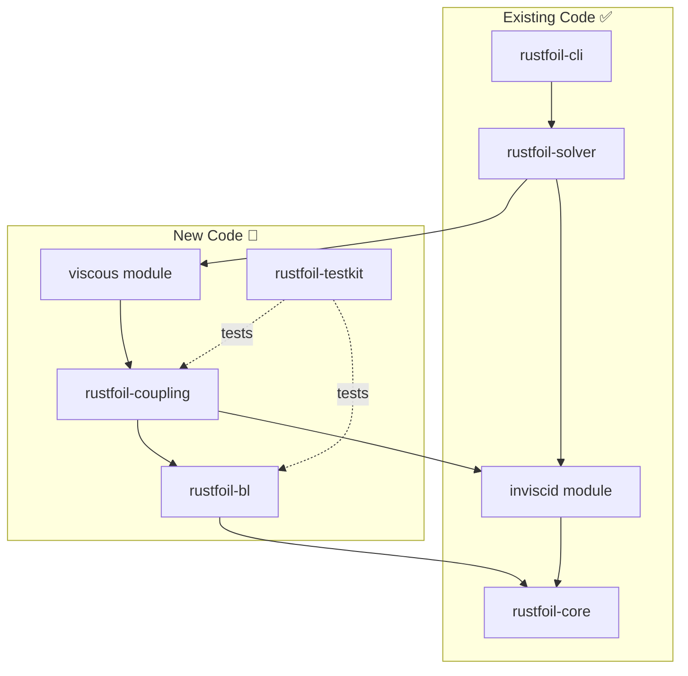

# RustFoil Viscous Solver Implementation Plan

This document outlines the complete implementation plan for adding viscous-inviscid coupling to RustFoil, replicating XFOIL's boundary layer solver in Rust.

## Copy-Paste Prompts for New Chats

Use these prompts in fresh Cursor chat sessions. Each wave should complete before the next begins (except Wave 3, which runs in parallel).

### Wave 1: Test Infrastructure

```text
@docs/tasks/TASK_01_TESTKIT.md

Implement this task completely. Create the rustfoil-testkit crate with:
1. Cargo.toml with serde, serde_json, tempfile dependencies
2. src/lib.rs exporting modules
3. src/fortran_runner.rs for compiling/running FORTRAN
4. src/approx.rs for float comparison
5. fortran/Makefile for building test harnesses
6. fortran/test_closures.f with HKIN test generation

Update the workspace Cargo.toml to include the new crate.
Verify with: cd crates/rustfoil-testkit/fortran && make
```

### Wave 2: Constants

```text
@docs/tasks/TASK_02_BL_CONSTANTS.md

Implement this task completely. Create the rustfoil-bl crate with:
1. Cargo.toml depending on rustfoil-core
2. src/lib.rs
3. src/constants.rs with all BLPAR.INC constants (SCCON, GACON, GBCON, etc.)
4. src/closures/mod.rs (empty, ready for closure functions)

Update workspace Cargo.toml. Verify with: cargo build -p rustfoil-bl
```

### Wave 3: Closures (7 PARALLEL Chats)

Open 7 separate Cursor chats and run these simultaneously:

<details>
<summary><strong>Chat 3A - HKIN</strong></summary>

```text
@docs/tasks/TASK_03_HKIN.md

Implement the HKIN closure function in rustfoil-bl/src/closures/hkin.rs.
Port XFOIL's xblsys.f line 2276 exactly. Include:
1. HkinResult struct with hk, hk_h, hk_msq
2. hkin(h, msq) function
3. Unit tests with numerical derivative verification
4. Update closures/mod.rs to export

Verify with: cargo test -p rustfoil-bl hkin
```

</details>

<details>
<summary><strong>Chat 3B - HS (Energy Shape Factors)</strong></summary>

```text
@docs/tasks/TASK_04_HS.md

Implement HSL and HST closures in rustfoil-bl/src/closures/hs.rs.
Port XFOIL's xblsys.f lines 2327 (HSL) and 2388 (HST). Include:
1. HsResult struct with hs, hs_hk, hs_rt, hs_msq
2. hs_laminar() and hs_turbulent() functions with full derivatives
3. Unit tests
4. Update closures/mod.rs

Verify with: cargo test -p rustfoil-bl hs
```

</details>

<details>
<summary><strong>Chat 3C - CF (Skin Friction)</strong></summary>

```text
@docs/tasks/TASK_05_CF.md

Implement CFL and CFT closures in rustfoil-bl/src/closures/cf.rs.
Port XFOIL's xblsys.f lines 2354 (CFL) and 2483 (CFT). Include:
1. CfResult struct with cf, cf_hk, cf_rt, cf_msq
2. cf_laminar() and cf_turbulent() functions
3. Unit tests with derivative verification
4. Update closures/mod.rs

Verify with: cargo test -p rustfoil-bl cf
```

</details>

<details>
<summary><strong>Chat 3D - Dissipation</strong></summary>

```text
@docs/tasks/TASK_06_DISSIPATION.md

Implement DIL, DIT, DILW in rustfoil-bl/src/closures/dissipation.rs.
Port XFOIL's xblsys.f lines 2290, 2375, 2308. Include:
1. DissipationResult structs
2. dissipation_laminar(), dissipation_turbulent(), dissipation_wake()
3. Unit tests
4. Update closures/mod.rs

Verify with: cargo test -p rustfoil-bl dissipation
```

</details>

<details>
<summary><strong>Chat 3E - Density Shape Factor</strong></summary>

```text
@docs/tasks/TASK_07_DENSITY.md

Implement HCT in rustfoil-bl/src/closures/density.rs.
Port XFOIL's xblsys.f line 2514. Include:
1. HctResult struct with hc, hc_hk, hc_msq
2. density_shape() function (Whitfield correlation)
3. Unit tests with numerical derivative checks
4. Update closures/mod.rs

Verify with: cargo test -p rustfoil-bl density
```

</details>

<details>
<summary><strong>Chat 3F - Transition</strong></summary>

```text
@docs/tasks/TASK_08_TRANSITION.md

Implement DAMPL in rustfoil-bl/src/transition.rs.
Port XFOIL's xblsys.f line 1981 (Drela-Giles correlation). Include:
1. AmplificationResult struct with ax, ax_hk, ax_th, ax_rt
2. amplification_rate() function
3. check_transition() helper
4. Unit tests
5. Update lib.rs to export

Verify with: cargo test -p rustfoil-bl transition
```

</details>

<details>
<summary><strong>Chat 3G - State Structure</strong></summary>

```text
@docs/tasks/TASK_09_STATE.md

Implement BlStation in rustfoil-bl/src/state.rs.
Match XFOIL's XBL.INC common block. Include:
1. BlStation struct with all primary variables (x, u, theta, delta_star, ctau, ampl)
2. All secondary variables (h, hk, hs, hc, r_theta, cf, cd)
3. BlDerivatives struct for Jacobian partials
4. BlStation::new() and BlStation::stagnation() constructors
5. Update lib.rs to export

Verify with: cargo test -p rustfoil-bl state
```

</details>

### Wave 4: Equations

```text
@docs/tasks/TASK_10_EQUATIONS.md

Implement BLVAR and BLDIF in rustfoil-bl/src/equations.rs.
Port XFOIL's xblsys.f lines 784 and 1552. Include:
1. blvar() - compute all secondary variables from primary
2. BlResiduals struct for equation residuals
3. BlJacobian struct for Newton blocks
4. bldif() - compute residuals and Jacobian between stations
5. Unit tests
6. Update lib.rs

This requires all closures from Wave 3 to be complete.
Verify with: cargo test -p rustfoil-bl equations
```

### Wave 5: Coupling Crate + DIJ

```text
@docs/tasks/TASK_11_COUPLING_DIJ.md

Create rustfoil-coupling crate and implement QDCALC.
1. Create crate structure with Cargo.toml (depends on rustfoil-core, rustfoil-bl, nalgebra)
2. src/lib.rs exporting all modules
3. src/dij.rs with build_dij_matrix() - mass defect influence
4. Update workspace Cargo.toml

Verify with: cargo build -p rustfoil-coupling
```

### Wave 6: Newton System

```text
@docs/tasks/TASK_12_COUPLING_NEWTON.md

Implement BLSYS in rustfoil-coupling/src/newton.rs.
Port XFOIL's xblsys.f line 583. Include:
1. BlNewtonSystem struct with VA, VB blocks and RHS
2. CoupledNewtonSystem for full viscous-inviscid coupling
3. build() method to construct system from stations
4. max_residual() for convergence checking

Verify with: cargo test -p rustfoil-coupling newton
```

### Wave 7: Block Solver

```text
@docs/tasks/TASK_13_COUPLING_SOLVE.md

Implement BLSOLV in rustfoil-coupling/src/solve.rs.
Port XFOIL's xsolve.f line 283. Include:
1. solve_bl_system() - block Gaussian elimination
2. Forward sweep to eliminate lower diagonal
3. Back substitution
4. Helper functions: invert_3x3, multiply_3x3, multiply_3x3_vec

Verify with: cargo test -p rustfoil-coupling solve
```

### Wave 8: BL Marching

```text
@docs/tasks/TASK_14_COUPLING_MARCH.md

Implement MRCHUE and MRCHDU in rustfoil-coupling/src/march.rs.
Port XFOIL's xbl.f lines 542 and 875. Include:
1. MarchResult struct with stations, x_transition, x_separation
2. MarchConfig for ncrit, tolerance, max_iter
3. march_fixed_ue() - BL march with prescribed Ue
4. march_coupled() - BL march with Ue updates

Verify with: cargo test -p rustfoil-coupling march
```

### Wave 9: Update Functions

```text
@docs/tasks/TASK_15_COUPLING_UPDATE.md

Implement UPDATE and UESET in rustfoil-coupling/src/update.rs.
Port XFOIL's xbl.f line 1253 and xpanel.f line 1758. Include:
1. UpdateConfig for limiting parameters
2. update_stations() - apply Newton updates with limiting
3. set_edge_velocities() - compute Ue from inviscid + mass defect
4. limit_change() helper for stability

Verify with: cargo test -p rustfoil-coupling update
```

### Wave 10: Main Solver

```text
@docs/tasks/TASK_16_VISCAL.md

Implement VISCAL in rustfoil-solver/src/viscous/.
Port XFOIL's xoper.f line 2886. Create:
1. src/viscous/mod.rs
2. src/viscous/config.rs - ViscousSolverConfig
3. src/viscous/viscal.rs - solve_viscous(), solve_viscous_polar_parallel()
4. src/viscous/forces.rs - compute_forces(), AeroForces
5. Update rustfoil-solver Cargo.toml to depend on rustfoil-coupling

Verify with: cargo build -p rustfoil-solver
```

### Wave 11: CLI Commands

```text
@docs/tasks/TASK_17_CLI.md

Add viscous commands to rustfoil-cli/src/main.rs. Include:
1. ViscousCmd struct with alpha, re, mach, ncrit options
2. ViscousPolarCmd struct with alpha range, parallel flag
3. run_viscous() and run_viscous_polar() implementations
4. Add to Commands enum and main match

Test with: cargo run -p rustfoil-cli -- viscous --help
```

### Wave 12: Integration Tests

```text
@docs/tasks/TASK_18_INTEGRATION_TESTS.md

Create end-to-end tests in rustfoil-solver/tests/. Include:
1. xfoil_comparison.rs - compare with XFOIL binary
2. XfoilRunner helper struct
3. test_naca0012_vs_xfoil() (ignored, run manually)
4. test_blasius_flat_plate() - analytical validation
5. test_transition_location()
6. test_separation_detection()

Run with: cargo test -p rustfoil-solver --test xfoil_comparison
```

---

## Executive Summary

| Metric | Value |
|--------|-------|
| **New Rust code** | ~4,000 lines |
| **FORTRAN test harnesses** | ~500 lines |
| **New crates** | 3 (rustfoil-testkit, rustfoil-bl, rustfoil-coupling) |
| **Tasks** | 18 |
| **Parallelizable tasks** | 7 (in Wave 3) |

## Architecture Overview



## Crate Structure

```
/crates/
├── rustfoil-core/           ✅ COMPLETE
│   ├── body.rs              # Multi-body airfoil representation
│   ├── panel.rs             # Panel discretization
│   ├── point.rs             # 2D geometry
│   ├── spline.rs            # Cubic splines + PANGEN
│   ├── xfoil_spline.rs      # Hermite splines
│   └── naca.rs              # NACA generators
│
├── rustfoil-solver/         ⚠️ INVISCID COMPLETE
│   ├── inviscid/            ✅ Panel method, velocities
│   └── viscous/             🚧 NEW - VISCAL, forces
│
├── rustfoil-bl/             🚧 NEW
│   ├── constants.rs         # BLPAR constants
│   ├── state.rs             # BlStation struct
│   ├── closures/            # HKIN, HS, CF, DI, HCT
│   ├── transition.rs        # DAMPL, TRCHEK2
│   └── equations.rs         # BLVAR, BLDIF
│
├── rustfoil-coupling/       🚧 NEW
│   ├── dij.rs               # QDCALC mass defect
│   ├── newton.rs            # BLSYS system builder
│   ├── solve.rs             # BLSOLV block solver
│   ├── march.rs             # MRCHUE, MRCHDU
│   └── update.rs            # UPDATE, UESET
│
├── rustfoil-testkit/        🚧 NEW
│   ├── fortran_runner.rs    # Compile & run FORTRAN
│   ├── approx.rs            # Float comparison
│   └── fortran/             # Test harnesses
│
├── rustfoil-cli/            ⚠️ NEEDS VISCOUS COMMANDS
└── rustfoil-wasm/           ⚠️ NEEDS VISCOUS BINDINGS
```

## FORTRAN Function Mapping

### Closure Functions (rustfoil-bl)

| Rust Function | FORTRAN | File:Line | Purpose |
|---------------|---------|-----------|---------|
| `hkin()` | HKIN | xblsys.f:2276 | Kinematic shape factor Hk |
| `hs_laminar()` | HSL | xblsys.f:2327 | Laminar energy shape factor |
| `hs_turbulent()` | HST | xblsys.f:2388 | Turbulent energy shape factor |
| `cf_laminar()` | CFL | xblsys.f:2354 | Laminar skin friction |
| `cf_turbulent()` | CFT | xblsys.f:2483 | Turbulent skin friction |
| `dissipation_laminar()` | DIL | xblsys.f:2290 | Laminar dissipation |
| `dissipation_turbulent()` | DIT | xblsys.f:2375 | Turbulent dissipation |
| `dissipation_wake()` | DILW | xblsys.f:2308 | Wake dissipation |
| `density_shape()` | HCT | xblsys.f:2514 | Density shape factor |
| `amplification_rate()` | DAMPL | xblsys.f:1981 | Transition amplification |

### Equations (rustfoil-bl)

| Rust Function | FORTRAN | File:Line | Purpose |
|---------------|---------|-----------|---------|
| `blvar()` | BLVAR | xblsys.f:784 | Compute secondary BL variables |
| `bldif()` | BLDIF | xblsys.f:1552 | BL equation residuals + Jacobian |

### Coupling (rustfoil-coupling)

| Rust Function | FORTRAN | File:Line | Purpose |
|---------------|---------|-----------|---------|
| `build_dij_matrix()` | QDCALC | xpanel.f:1149 | Mass defect influence |
| `BlNewtonSystem::build()` | BLSYS | xblsys.f:583 | Newton system construction |
| `solve_bl_system()` | BLSOLV | xsolve.f:283 | Block tridiagonal solver |
| `march_fixed_ue()` | MRCHUE | xbl.f:542 | BL march, fixed Ue |
| `march_coupled()` | MRCHDU | xbl.f:875 | BL march, coupled Ue |
| `update_stations()` | UPDATE | xbl.f:1253 | Apply Newton updates |
| `set_edge_velocities()` | UESET | xpanel.f:1758 | Set Ue from inviscid |

### Main Loop (rustfoil-solver)

| Rust Function | FORTRAN | File:Line | Purpose |
|---------------|---------|-----------|---------|
| `solve_viscous()` | VISCAL | xoper.f:2886 | Main viscous iteration |
| `compute_forces()` | CDCALC | xoper.f | Drag calculation |

## Implementation Tasks

### Execution Waves

```mermaid
gantt
    title Implementation Timeline
    dateFormat  X
    axisFormat %s
    
    section Wave 1
    Task 01 - Testkit           :w1t1, 0, 1
    
    section Wave 2
    Task 02 - Constants         :w2t2, 1, 2
    
    section Wave 3 (Parallel)
    Task 03 - HKIN              :w3t3, 2, 3
    Task 04 - HS                :w3t4, 2, 3
    Task 05 - CF                :w3t5, 2, 3
    Task 06 - Dissipation       :w3t6, 2, 3
    Task 07 - Density           :w3t7, 2, 3
    Task 08 - Transition        :w3t8, 2, 3
    Task 09 - State             :w3t9, 2, 3
    
    section Wave 4+
    Task 10 - Equations         :w4t10, 3, 4
    Task 11 - DIJ               :w4t11, 4, 5
    Task 12 - Newton            :w4t12, 5, 6
    Task 13 - Solve             :w4t13, 6, 7
    Task 14 - March             :w4t14, 7, 8
    Task 15 - Update            :w4t15, 8, 9
    Task 16 - VISCAL            :w4t16, 9, 10
    Task 17 - CLI               :w4t17, 10, 11
    Task 18 - Tests             :w4t18, 11, 12
```



### Task Details

#### Wave 1: Foundation

| Task | Name | Deliverables |
|------|------|--------------|
| 01 | **rustfoil-testkit** | FORTRAN compilation, JSON reference data, float comparison utilities |

#### Wave 2: Constants

| Task | Name | Deliverables |
|------|------|--------------|
| 02 | **BL Constants** | `rustfoil-bl` crate with BLPAR.INC constants |

#### Wave 3: Closures (Parallel)

| Task | Name | FORTRAN | Deliverables |
|------|------|---------|--------------|
| 03 | **HKIN** | xblsys.f:2276 | `hkin()` + derivatives + FORTRAN tests |
| 04 | **HS** | xblsys.f:2327,2388 | `hs_laminar()`, `hs_turbulent()` |
| 05 | **CF** | xblsys.f:2354,2483 | `cf_laminar()`, `cf_turbulent()` |
| 06 | **Dissipation** | xblsys.f:2290,2375,2308 | `dissipation_*()` functions |
| 07 | **Density** | xblsys.f:2514 | `density_shape()` (HCT) |
| 08 | **Transition** | xblsys.f:1981 | `amplification_rate()`, `check_transition()` |
| 09 | **State** | XBL.INC | `BlStation` struct with all derivatives |

#### Wave 4: Equations

| Task | Name | FORTRAN | Deliverables |
|------|------|---------|--------------|
| 10 | **Equations** | xblsys.f:784,1552 | `blvar()`, `bldif()` |

#### Wave 5: Coupling

| Task | Name | FORTRAN | Deliverables |
|------|------|---------|--------------|
| 11 | **DIJ Matrix** | xpanel.f:1149 | `rustfoil-coupling` crate, `build_dij_matrix()` |
| 12 | **Newton System** | xblsys.f:583 | `BlNewtonSystem`, `CoupledNewtonSystem` |
| 13 | **Block Solver** | xsolve.f:283 | `solve_bl_system()` |
| 14 | **BL March** | xbl.f:542,875 | `march_fixed_ue()`, `march_coupled()` |
| 15 | **Update** | xbl.f:1253 | `update_stations()`, `set_edge_velocities()` |

#### Wave 6: Integration

| Task | Name | Deliverables |
|------|------|--------------|
| 16 | **VISCAL** | `solve_viscous()`, `solve_viscous_polar_parallel()` |
| 17 | **CLI** | `rustfoil viscous`, `rustfoil viscous-polar` commands |
| 18 | **Integration Tests** | XFOIL comparison, Blasius validation |

## Testing Strategy

### Unit Tests (Per Function)

Every Rust closure function is tested against FORTRAN:

```rust
#[test]
fn test_hkin_matches_fortran() {
    let reference: Vec<HkinTest> = load_reference("closures/hkin.json");
    for t in reference {
        let result = hkin(t.h, t.msq);
        assert_relative_eq!(result.hk, t.hk, epsilon = 1e-10);
        assert_relative_eq!(result.hk_h, t.hk_h, epsilon = 1e-10);
        assert_relative_eq!(result.hk_msq, t.hk_msq, epsilon = 1e-10);
    }
}
```

### Integration Tests

| Test Case | Inputs | Validation |
|-----------|--------|------------|
| Blasius flat plate | Re=1e6, α=0° | H ≈ 2.59 |
| NACA 0012 low-α | Re=3e6, α=4° | CL within 0.01 of XFOIL |
| NACA 0012 high-α | Re=3e6, α=12° | CD within 0.001 of XFOIL |
| Transition | Re=3e6 | x_tr within 0.02 of XFOIL |

### Test Data Generation

```fortran
PROGRAM TEST_CLOSURES
    INCLUDE 'BLPAR.INC'
    ! Initialize constants
    SCCON = 5.6
    GACON = 6.70
    ! ... etc
    
    ! Generate JSON test vectors
    CALL TEST_HKIN()
    CALL TEST_HSL()
    ! ... etc
END
```

## CLI Commands

### New Commands

```bash
# Single-point viscous analysis
rustfoil viscous naca0012.dat -a 5.0 -r 3e6 [-m 0.3] [--ncrit 9]

# Viscous polar generation
rustfoil viscous-polar naca0012.dat --alpha "-4:12:0.5" -r 3e6 [--parallel]
```

### Output Example

```
Viscous Analysis Results
========================
Alpha:        5.000°
CL:          0.5432
CD:          0.00654
CM:         -0.0123
x_tr (U):    0.0312
x_tr (L):    0.4521
Converged:   true
```

## Key Algorithms

### VISCAL Main Loop

```
1. Solve inviscid for current α
2. Initialize BL from stagnation point
3. REPEAT:
   a. Build Newton system (SETBL → BLSYS)
   b. Solve block-tridiagonal system (BLSOLV)
   c. Update BL variables with limiting (UPDATE)
   d. Update edge velocities (UESET)
   e. Check convergence
4. Compute forces (CDCALC)
```

### Newton System Structure

Block-tridiagonal with 3 equations per station:
- Momentum integral
- Shape parameter equation
- Amplification (laminar) or shear stress (turbulent)

```
┌─────┬─────┬─────┬─────┐   ┌────┐   ┌────┐
│ VA₁ │ VC₁ │     │     │   │ Δx₁│   │ R₁ │
├─────┼─────┼─────┼─────┤   ├────┤   ├────┤
│ VB₂ │ VA₂ │ VC₂ │     │ × │ Δx₂│ = │ R₂ │
├─────┼─────┼─────┼─────┤   ├────┤   ├────┤
│     │ VB₃ │ VA₃ │ VC₃ │   │ Δx₃│   │ R₃ │
├─────┼─────┼─────┼─────┤   ├────┤   ├────┤
│     │     │ VB₄ │ VA₄ │   │ Δx₄│   │ R₄ │
└─────┴─────┴─────┴─────┘   └────┘   └────┘
```

## File Locations

| Resource | Path |
|----------|------|
| Task files | `/docs/tasks/TASK_*.md` |
| FORTRAN source | `/Xfoil/src/` |
| Rust workspace | `/Users/harry/flexfoil/crates/` |
| gfortran | `/opt/homebrew/bin/gfortran` |

## How to Execute

1. **Start new Cursor chat** for each task
2. **Reference task file**: `@docs/tasks/TASK_XX_NAME.md`
3. **Instruct**: "Implement this task as specified"
4. **Verify** deliverables, commit, proceed to next task

For parallel execution (Wave 3), open 7 separate chats simultaneously.
