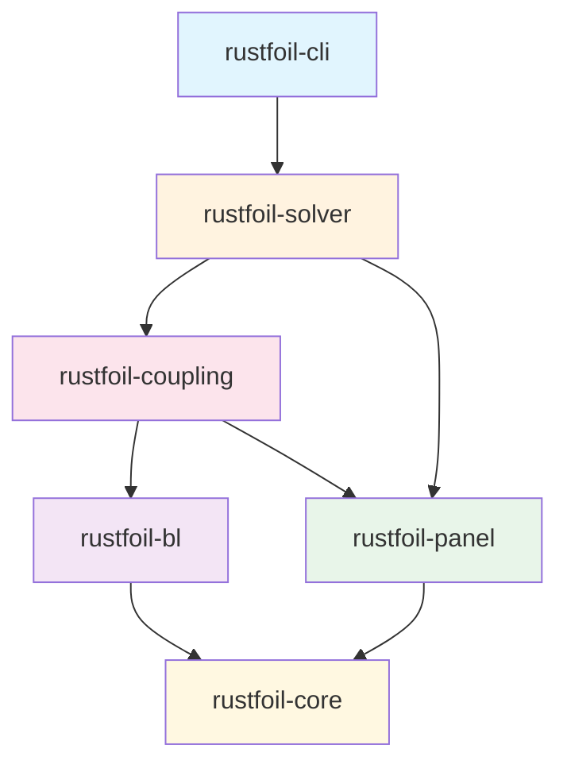
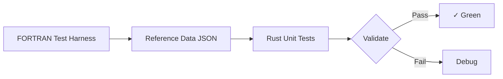

# RustFoil Implementation Specification

> **Document Status**: Implementation Plan  
> **Target**: Rust port of XFOIL 6.99 with parallelization & GPU acceleration  
> **Last Updated**: 2026-01-20

---

## Executive Summary

### Goals

1. **Correctness First**: Bit-accurate reproduction of XFOIL results for identical inputs
2. **Performance**: 10-100× speedup for polar sweeps via parallelization
3. **Extensibility**: Clean module boundaries enabling future GPU acceleration
4. **Usability**: Modern CLI with structured output (JSON/CSV) for automation

### Non-Goals (Phase 1)

- GUI (defer to separate `rustfoil-ui` crate)
- Airfoil design/inverse mode (MDES, QDES)
- Multi-element airfoils
- 3D corrections

### Key Architectural Decisions

| Decision | Rationale |
|----------|-----------|
| Workspace with multiple crates | Separation of concerns, independent testing |
| `nalgebra` for linear algebra | Mature, SIMD-optimized, GPU-portable via `nalgebra-glm` |
| `rayon` for CPU parallelism | Zero-overhead abstractions, easy data parallelism |
| Immutable state + explicit mutation | Easier reasoning about Newton iterations |
| f64 throughout | Match FORTRAN `REAL*8`, avoid precision issues |

---

## CLI Specification

### Binary Name

```
rustfoil
```

### Subcommands

```
rustfoil <COMMAND>

Commands:
  analyze    Single-point or sweep analysis (viscous or inviscid)
  polar      Generate polar data over alpha/CL range
  dump       Export internal state for debugging
  validate   Run validation suite against XFOIL reference data
  help       Print help information

Global Options:
  -v, --verbose    Increase verbosity (-v, -vv, -vvv)
  -q, --quiet      Suppress non-error output
  --json           Output results as JSON
  --csv            Output results as CSV
  --threads <N>    Number of threads (default: num_cpus)
```

### `analyze` Subcommand

```bash
rustfoil analyze [OPTIONS] <AIRFOIL>

Arguments:
  <AIRFOIL>    Path to airfoil file (.dat) or NACA spec (e.g., "naca0012")

Options:
  -a, --alpha <DEG>       Angle of attack in degrees [required unless --cl]
  -c, --cl <CL>           Target lift coefficient (solve for alpha)
  -r, --re <RE>           Reynolds number [required for viscous]
  -m, --mach <M>          Mach number [default: 0.0]
  -n, --ncrit <N>         Transition Ncrit [default: 9.0]
  --inviscid              Run inviscid-only analysis
  --panels <N>            Number of panels [default: 160]
  --max-iter <N>          Max Newton iterations [default: 100]
  --tolerance <TOL>       Convergence tolerance [default: 1e-4]
  -o, --output <FILE>     Write results to file
```

**Examples:**

```bash
# Single point analysis
rustfoil analyze naca0012 -a 5.0 -r 3e6

# Solve for alpha given CL
rustfoil analyze airfoil.dat --cl 0.5 -r 1e6 -m 0.3

# Inviscid only
rustfoil analyze naca2412 -a 0 --inviscid

# JSON output for scripting
rustfoil analyze naca0012 -a 8 -r 3e6 --json
```

### `polar` Subcommand

```bash
rustfoil polar [OPTIONS] <AIRFOIL>

Options:
  --alpha <START:END:STEP>   Alpha range (e.g., "-5:20:0.5")
  --cl <START:END:STEP>      CL range (e.g., "0:1.5:0.1")
  -r, --re <RE>              Reynolds number [required]
  -m, --mach <M>             Mach number [default: 0.0]
  --parallel                 Enable parallel alpha sweep [default: true]
  --continue-on-fail         Continue sweep even if some points fail
```

### Output Formats

**JSON (single point):**
```json
{
  "airfoil": "naca0012",
  "alpha": 8.0,
  "re": 3000000,
  "results": {
    "cl": 0.9012,
    "cd": 0.00982,
    "cm": -0.0234,
    "x_tr_upper": 0.0312,
    "x_tr_lower": 0.4521
  },
  "converged": true,
  "iterations": 8
}
```

---

## Crate Architecture

### Workspace Layout



### Crate Responsibilities

| Crate | Responsibility | Key Types |
|-------|---------------|-----------|
| `rustfoil-core` | Geometry, splines, I/O | `Airfoil`, `CubicSpline` |
| `rustfoil-panel` | Inviscid panel method | `Panel`, `InfluenceMatrices` |
| `rustfoil-bl` | Boundary layer physics | `BlStation`, `BlState`, closures |
| `rustfoil-coupling` | Viscous-inviscid coupling | `NewtonSystem`, `march`, `inverse` |
| `rustfoil-solver` | Top-level orchestration | `solve_viscous`, `generate_polar` |
| `rustfoil-cli` | Command-line interface | Commands, formatters |

---

## FORTRAN → Rust Function Mapping

### Panel Method Functions

| FORTRAN | Rust Module | Rust Function | Parallelizable |
|---------|-------------|---------------|----------------|
| `PSILIN` | rustfoil-panel | `influence::psilin` | N/A (leaf) |
| `AIJSET` | rustfoil-panel | `InfluenceMatrices::build_aij` | **Yes** (rows) |
| `BIJSET` | rustfoil-panel | `InfluenceMatrices::build_bij` | **Yes** (rows) |
| `QDCALC` | rustfoil-panel | `InfluenceMatrices::build_dij` | **Yes** (rows) |
| `GAMSOLV` | rustfoil-panel | `solve::unit_solutions` | No (single LU) |
| `XYWAKE` | rustfoil-panel | `wake::generate` | No |

### Boundary Layer Closures

| FORTRAN | Rust Function | Returns | Notes |
|---------|---------------|---------|-------|
| `HKIN` | `closures::hkin` | Hk, ∂Hk/∂H, ∂Hk/∂M² | Compressibility correction |
| `HSL` | `closures::hs_laminar` | H*, ∂H*/∂Hk | No Rθ dependence |
| `HST` | `closures::hs_turbulent` | H*, derivatives | Has Rθ branches |
| `CFL` | `closures::cf_laminar` | Cf, derivatives | Falkner-Skan |
| `CFT` | `closures::cf_turbulent` | Cf, derivatives | Coles wall-law |
| `DIL` | `closures::dissipation_laminar` | 2CD/H* | |
| `DIT` | `closures::dissipation_turbulent` | 2CD/H* | |
| `HCT` | `closures::density_shape` | H** | |

### Newton System Functions

| FORTRAN | Rust Function | Parallelizable |
|---------|---------------|----------------|
| `SETBL` | `NewtonSystem::build` | Partially |
| `BLSYS` | `build_station_system` | **Yes** (stations) |
| `MRCHUE` | `march::initialize_bl` | No (sequential) |
| `MRCHDU` | `march::establish_transition` | No (sequential) |
| `BLSOLV` | `NewtonSystem::solve` | No (block elim) |
| `UPDATE` | `apply_updates` | **Yes** (stations) |
| `VISCAL` | `solve_viscous` | No (iteration loop) |

---

## Parallelization Strategy

### Parallelization Opportunities

| Operation | Data Size | Parallel Strategy | Expected Speedup |
|-----------|-----------|-------------------|------------------|
| AIJ matrix build | N² | Parallelize rows | ~8× (8 cores) |
| BIJ matrix build | N² | Parallelize rows | ~8× |
| DIJ matrix build | N² | Parallelize rows | ~8× |
| QINV computation | N | Parallelize stations | ~4× |
| **Polar sweep** | M points | Parallelize α points | **~M×** |

### Influence Matrix Parallelization

```rust
use rayon::prelude::*;

pub fn build_aij_parallel(panels: &[Panel]) -> DMatrix<f64> {
    let n = panels.len();
    let mut aij = DMatrix::zeros(n, n);
    
    // Each row is independent - parallelize over rows
    aij.par_row_iter_mut()
        .enumerate()
        .for_each(|(i, mut row)| {
            let point = panels[i].midpoint;
            for (j, panel) in panels.iter().enumerate() {
                let (psi, _, _) = psilin(panel, &point);
                row[j] = psi;
            }
        });
    
    aij
}
```

### Polar Sweep Parallelization

This is the **highest-impact** parallelization:

```rust
pub fn generate_polar_parallel(
    airfoil: &Airfoil,
    alpha_points: &[f64],
    config: &SolverConfig,
) -> Vec<Result<AnalysisResult, SolverError>> {
    // Pre-compute geometry and influence matrices (shared)
    let panels = PanelSystem::from_airfoil(airfoil, config.n_panels);
    let influence = InfluenceMatrices::build(&panels);
    
    // Each alpha point is completely independent
    alpha_points.par_iter()
        .map(|&alpha| {
            let mut solver = ViscousSolver::new(&panels, &influence, config);
            solver.solve(alpha)
        })
        .collect()
}
```

**Expected speedup: Near-linear with core count** for large sweeps.

---

## GPU Acceleration Roadmap

### Phase 1: CPU Baseline (Current Spec)
- Pure Rust with `nalgebra`
- `rayon` for CPU parallelism

### Phase 2: GPU-Ready Abstraction
- Abstract linear algebra backend
- Trait-based dispatch (CPU vs GPU)

### Phase 3: GPU Implementation

| Operation | GPU Benefit | Implementation |
|-----------|-------------|----------------|
| Influence matrices | High (N² independent) | `wgpu` compute shader |
| Matrix-vector products | Medium | `wgpu` or `cuBLAS` |
| LU factorization | Low (N small ~300) | Keep on CPU |
| Polar sweep | High | Multiple GPU streams |

### Estimated GPU Speedups

| Operation | CPU Time | GPU Time | Speedup |
|-----------|----------|----------|---------|
| Build AIJ/BIJ/DIJ | 50ms | 2ms | 25× |
| Full solve (1 point) | 100ms | 20ms | 5× |
| Polar (100 points) | 10s | 200ms | **50×** |

---

## Validation & Test Specification

### Test Strategy



### Closure Function Tests

All closures must match FORTRAN to **1e-10** tolerance:

```rust
#[test]
fn test_hkin_against_fortran() {
    let tests = load_closure_tests().hkin_tests;
    for t in tests {
        let result = hkin(t.h, t.msq);
        assert_relative_eq!(result.value, t.expected_hk, epsilon = 1e-10);
    }
}
```

### Integration Tests

| Test | Criterion | Tolerance |
|------|-----------|-----------|
| Flat plate | θ/x = 0.664/√Rex | 5% |
| NACA 0012 CL | Match XFOIL | 0.005 |
| NACA 0012 CD | Match XFOIL | 0.0005 |
| Transition location | Match XFOIL | 2% chord |
| CL_max (stall) | 1.1 < CL_max < 1.4 | - |

### Test Coverage Requirements

| Module | Coverage |
|--------|----------|
| rustfoil-bl::closures | **100%** |
| rustfoil-bl::transition | **100%** |
| rustfoil-panel | 85%+ |
| rustfoil-coupling | 80%+ |
| rustfoil-solver | 75%+ |

---

## Implementation Phases

### Phase 1: Foundation (Weeks 1-2)
- [ ] `rustfoil-core`: Airfoil I/O, splines, NACA
- [ ] `rustfoil-panel`: Panel method, AIJ matrix
- [ ] Basic `analyze --inviscid` command

### Phase 2: Closure Relations (Week 3)
- [ ] All closures with derivatives
- [ ] FORTRAN reference data generation
- [ ] 100% unit test coverage

### Phase 3: Transition (Week 4)
- [ ] e^N method (DAMPL, TRCHEK)
- [ ] Validate vs XFOIL

### Phase 4: Newton System (Weeks 5-6)
- [ ] BL marching (MRCHUE, MRCHDU)
- [ ] Newton system build/solve
- [ ] Direct mode working

### Phase 5: Inverse Mode & Stall (Week 7)
- [ ] Hk-prescribed inverse mode
- [ ] Mode switching logic
- [ ] CL_max prediction

### Phase 6: Parallelization (Week 8)
- [ ] Parallel influence matrices
- [ ] Parallel polar sweep
- [ ] Benchmarking

### Phase 7: Polish (Week 9)
- [ ] Full CLI
- [ ] Documentation
- [ ] v0.1.0 release

---

## Appendix: Numerical Tolerances

| Comparison | Tolerance | Rationale |
|------------|-----------|-----------|
| Closure functions | 1e-10 | Must match exactly |
| Transition location | 0.02 chord | Sensitive to Hk |
| CL | 0.005 | ~0.5% relative |
| CD | 0.0005 | ~5% relative |
| Newton convergence | 1e-4 | Match XFOIL |

---

*For the full specification with complete code examples and FORTRAN mappings, see [RUSTFOIL_IMPLEMENTATION_SPEC.md](https://github.com/flexfoil/flexfoil/blob/main/docs/RUSTFOIL_IMPLEMENTATION_SPEC.md)*
