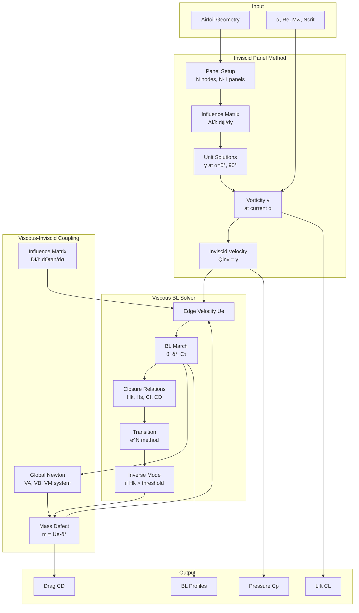
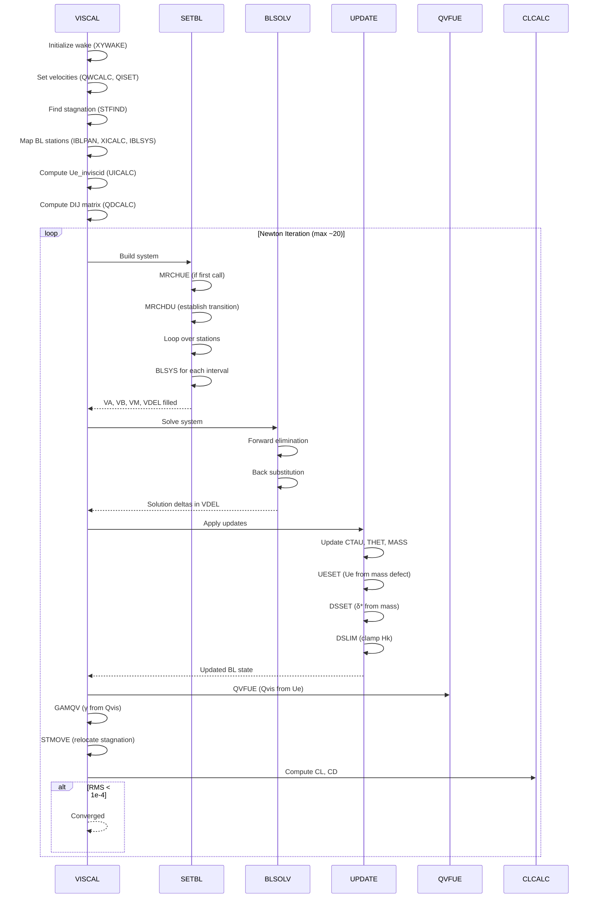
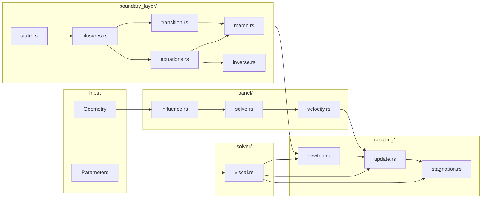

import HkCorrelationPlot from '@site/src/components/Interactive/HkCorrelationPlot';

# How XFOIL Works

> **Document Status**: Specification for Rust implementation  
> **Source**: XFOIL 6.99 FORTRAN source code analysis  
> **Last Updated**: 2026-01-20

---

## One-Page Mental Model

### Core Concept

XFOIL solves the **viscous-inviscid coupling** problem for airfoil analysis. The inviscid (panel method) and viscous (boundary layer) solutions are coupled through the **displacement effect**: the boundary layer displaces the inviscid flow, which changes the pressure distribution, which changes the boundary layer.

### Key Principles

- **Linear vorticity panels** compute inviscid flow with stream function formulation
- **Integral boundary layer** equations march from stagnation point along both surfaces and wake
- **Mass defect coupling**: boundary layer displacement is modeled as distributed sources `σ = d(Ue·δ*)/ds`
- **Global Newton iteration** simultaneously solves for all BL variables and their coupling to inviscid flow
- **Direct/Inverse mode switching** handles separation: when Hk exceeds threshold, prescribe Hk and solve for Ue
- **Transition prediction** via envelope e^N method with critical amplification Ncrit (typically 9)

### The Stall Mechanism

Stall emerges naturally from the physics:

```
High α → Adverse pressure gradient → Hk increases → Exceeds threshold
       → Switch to inverse mode → Prescribe Hk, solve for Ue
       → Ue reduced in separated region → Suction peak reduced → Cl drops
```

This is **not** an explicit stall model—it's a consequence of properly handling separation in the viscous-inviscid coupling.

### Variable Naming Convention

| Symbol | FORTRAN | Meaning |
|--------|---------|---------|
| θ | `THET` | Momentum thickness |
| δ* | `DSTR` | Displacement thickness |
| H | `H` | Shape factor δ*/θ |
| Hk | `HK` | Kinematic shape parameter |
| H* | `HS` | Energy shape parameter |
| Ue | `UEDG` | BL edge velocity |
| Cτ | `CTAU` | Shear stress coefficient (turbulent) or amplification N (laminar) |
| Cf | `CF` | Skin friction coefficient |
| Rθ | `RT` | Momentum thickness Reynolds number |
| m | `MASS` | Mass defect = Ue·δ* |

### End-to-End Dataflow



---

## Execution Path

### Entrypoints Table

| Entrypoint | File:Line | Calls | Purpose | Key State Mutated |
|------------|-----------|-------|---------|-------------------|
| `VISCAL` | `xoper.f:2886` | SETBL, BLSOLV, UPDATE | Main viscous iteration loop | UEDG, THET, DSTR, CTAU, MASS, CL, CD |
| `SETBL` | `xbl.f:21` | MRCHUE, MRCHDU, BLSYS | Build Newton system | VA, VB, VM, VDEL, ITRAN |
| `MRCHUE` | `xbl.f:542` | BLPRV, BLKIN, BLVAR, TRCHEK | Initialize BL with direct/inverse | THET, DSTR, CTAU, UEDG (inverse) |
| `MRCHDU` | `xbl.f:875` | BLSYS, TRCHEK | March BL to establish transition | ITRAN, AMPL |
| `BLSOLV` | `xsolve.f:283` | (inline block elim) | Solve Newton system | VDEL (solution deltas) |
| `UPDATE` | `xbl.f:1253` | UESET, DSSET, DSLIM | Apply Newton updates | CTAU, THET, MASS, UEDG, DSTR |
| `QDCALC` | `xpanel.f:1149` | PSILIN | Compute DIJ matrix | DIJ |
| `CLCALC` | `xoper.f` | (integration) | Compute lift | CL, CM, CL_ALF |
| `CDCALC` | `xoper.f` | (integration) | Compute drag | CD, CDF |

### Main Iteration Sequence



### MRCHUE Detail: Direct/Inverse Mode

The `MRCHUE` subroutine (xbl.f:542-840) is **critical for stall prediction**:

```
For each BL station:
  1. Try DIRECT mode:
     - Set VS2(4,4) = 1.0, VSREZ(4) = 0  (dUe = 0)
     - Solve 4x4 system for [dCτ, dθ, dδ*, dUe]
     - Compute resulting Hk

  2. Check threshold:
     - Laminar:   HLMAX = 3.8
     - Turbulent: HTMAX = 2.5
     - If Hk >= threshold → switch to INVERSE

  3. INVERSE mode (if needed):
     - Compute target: HTARG = Hk_upstream ± rate×dx/θ
     - Set VS2(4,2) = HK2_T2, VS2(4,3) = HK2_D2, VS2(4,4) = HK2_U2
     - Set VSREZ(4) = HTARG - HK2
     - Solve: Ue is now an unknown, Hk is prescribed
     - The reduced Ue propagates to lift calculation
```

**Source reference**: `xbl.f:650-738`

---

## Core Data Model

### Primary BL Arrays

| Array | Dimensions | Meaning | Units | Where Updated |
|-------|------------|---------|-------|---------------|
| `XSSI(IVX,ISX)` | [station, side] | BL arc length from stagnation | chord | `XICALC` |
| `UEDG(IVX,ISX)` | [station, side] | BL edge velocity | Qinf | `UESET`, `UPDATE` |
| `UINV(IVX,ISX)` | [station, side] | Inviscid edge velocity | Qinf | `UICALC` |
| `MASS(IVX,ISX)` | [station, side] | Mass defect = Ue·δ* | chord·Qinf | `UPDATE` |
| `THET(IVX,ISX)` | [station, side] | Momentum thickness θ | chord | `UPDATE`, `MRCHUE` |
| `DSTR(IVX,ISX)` | [station, side] | Displacement thickness δ* | chord | `DSSET`, `MRCHUE` |
| `CTAU(IVX,ISX)` | [station, side] | √(τmax/ρUe²) or N (laminar) | - | `UPDATE`, `MRCHUE` |

**Source**: `XFOIL.INC:152-162`

### Newton System Arrays

| Array | Dimensions | Meaning | Structure |
|-------|------------|---------|-----------|
| `VA(3,2,IZX)` | [row, col, station] | Diagonal block coefficients | 3×2 per station |
| `VB(3,2,IZX)` | [row, col, station] | Off-diagonal block coefficients | 3×2 per station |
| `VM(3,IZX,IZX)` | [row, from, to] | Mass influence vectors | Full coupling |
| `VZ(3,2)` | [row, col] | TE coupling block | Links wake to surface |
| `VDEL(3,2,IZX)` | [row, col, station] | Residuals (col 1) and Re sensitivity (col 2) | Solution vector |

**Source**: `XFOIL.INC:183-184`

### Station Variables (XBL.INC)

| Variable | Type | Meaning | Derivatives Available |
|----------|------|---------|----------------------|
| `X1, X2` | f64 | Arc length position | - |
| `U1, U2` | f64 | Edge velocity | `U_UEI`, `U_MS` |
| `T1, T2` | f64 | Momentum thickness θ | - |
| `D1, D2` | f64 | Displacement thickness δ* | - |
| `S1, S2` | f64 | Cτ (turbulent) or N (laminar) | - |
| `H1, H2` | f64 | Shape factor H = δ*/θ | `H_T`, `H_D` |
| `HK1, HK2` | f64 | Kinematic shape parameter | `HK_U`, `HK_T`, `HK_D`, `HK_MS` |
| `HS1, HS2` | f64 | Energy shape parameter | `HS_U`, `HS_T`, `HS_D`, `HS_MS`, `HS_RE` |
| `RT1, RT2` | f64 | Rθ Reynolds number | `RT_U`, `RT_T`, `RT_MS`, `RT_RE` |
| `CF1, CF2` | f64 | Skin friction Cf | `CF_U`, `CF_T`, `CF_D`, `CF_MS`, `CF_RE` |
| `DI1, DI2` | f64 | Dissipation 2CD/H* | `DI_U`, `DI_T`, `DI_D`, `DI_S`, `DI_MS`, `DI_RE` |

**Source**: `XBL.INC:17-44`

### Index Arrays

| Array | Meaning |
|-------|---------|
| `IBLTE(ISX)` | BL station index at trailing edge (per side) |
| `NBL(ISX)` | Total BL stations per side |
| `IPAN(IVX,ISX)` | Panel index for each BL station |
| `ISYS(IVX,ISX)` | Newton system line index for each BL station |
| `ITRAN(ISX)` | Transition station index per side |

**Source**: `XFOIL.INC:164-165`

### Dimensioning Parameters

| Parameter | Value | Meaning |
|-----------|-------|---------|
| `IQX` | 370 | Max surface panel nodes + 6 |
| `IWX` | IQX/8+2 | Max wake panel nodes |
| `IZX` | IQX+IWX | Total panel nodes |
| `IVX` | IQX/2+IWX+50 | Max BL stations per side |
| `ISX` | 2 | Number of sides (upper/lower) |

**Source**: `XFOIL.INC:23-27`

---

## Physics / Numerics Modules

### Closure Relations

**Purpose**: Relate integral BL quantities to each other through semi-empirical correlations.

#### HKIN - Kinematic Shape Parameter

**File**: `xblsys.f:2276`

```
Hk = (H - 0.29·M²) / (1 + 0.113·M²)
```

Compressibility correction via Whitfield's formula. Returns Hk and derivatives wrt H and M².

<HkCorrelationPlot initialMach={0} height={320} />

:::tip Interactive Demo
Use the slider above to see how compressibility affects the Hk correlation. At higher Mach numbers, the same shape factor H corresponds to a lower kinematic shape parameter Hk.
:::

#### HSL - Laminar Energy Shape Parameter

**File**: `xblsys.f:2327`

```
If Hk < 4.35:
    H* = 0.0111·(Hk-4.35)²/(Hk+1) - 0.0278·(Hk-4.35)³/(Hk+1) + 1.528 - 0.0002·(Hk·(Hk-4.35))²
Else:
    H* = 0.015·(Hk-4.35)²/Hk + 1.528
```

No Rθ dependence for laminar flow.

#### HST - Turbulent Energy Shape Parameter

**File**: `xblsys.f:2388`

Two branches based on Hk relative to Ho (which depends on Rθ):

```
Ho = 3 + 400/Rθ    (for Rθ > 400)
Ho = 4             (for Rθ ≤ 400)

If Hk < Ho (attached):
    H* = (2 - H*_min - 4/Rθ)·Hr²·1.5/(Hk+0.5) + H*_min + 4/Rθ
    where Hr = (Ho - Hk)/(Ho - 1)
Else (separated):
    H* = (Hk - Ho)²·[0.007·ln(Rθ)/(Hk-Ho+4/ln(Rθ))² + 0.015/Hk] + H*_min + 4/Rθ

Compressibility: H* = (H* + 0.028·M²) / (1 + 0.014·M²)
```

**Key parameters**: H*_min = 1.5, DHSINF = 0.015

#### CFL - Laminar Skin Friction

**File**: `xblsys.f:2354`

Falkner-Skan correlation:

```
If Hk < 5.5:
    Cf = [0.0727·(5.5-Hk)³/(Hk+1) - 0.07] / Rθ
Else:
    Cf = [0.015·(1 - 1/(Hk-4.5))² - 0.07] / Rθ
```

#### CFT - Turbulent Skin Friction

**File**: `xblsys.f:2483`

Coles wall-law correlation:

```
Fc = √(1 + 0.5·(γ-1)·M²)
Grt = max(ln(Rθ/Fc), 3)
Gex = -1.74 - 0.31·Hk
Cfo = CFFAC · 0.3 · exp(-1.33·Hk) · (Grt/2.3)^Gex
Cf = [Cfo + 1.1e-4·(tanh(4 - Hk/0.875) - 1)] / Fc
```

#### DIL - Laminar Dissipation

**File**: `xblsys.f:2290`

```
If Hk < 4:
    2CD/H* = [0.00205·(4-Hk)^5.5 + 0.207] / Rθ
Else:
    2CD/H* = [-0.0016·(Hk-4)²/(1+0.02·(Hk-4)²) + 0.207] / Rθ
```

#### HCT - Density Shape Parameter

**File**: `xblsys.f:2514`

```
H** = M² · (0.064/(Hk-0.8) + 0.251)
```

**Failure modes**:
- Hk approaching 1.0: singularities in correlations
- Very high Hk (>10): extrapolation unreliable
- Negative Rθ: physically impossible

---

### Transition Prediction

**Purpose**: Predict laminar-to-turbulent transition using envelope e^N method.

#### DAMPL - Amplification Rate

**File**: `xblsys.f:1981`

Reference: Drela & Giles, AIAA J. Oct 1987

**Algorithm**:

1. **Critical Rθ correlation**:
```
log₁₀(Rθ_crit) = 2.492/(Hk-1)^0.43 + 0.7·(tanh(14/(Hk-1) - 9.24) + 1)
```

2. **Below critical**: AX = 0 (no amplification)

3. **Above critical** (with smooth ramp):
```
RNORM = (log₁₀(Rθ) - (log₁₀(Rθ_crit) - DGR)) / (2·DGR)
RFAC = 3·RNORM² - 2·RNORM³   (cubic ramp)

Slope: DADR = 0.028·(Hk-1) - 0.0345·exp(-(3.87/(Hk-1) - 2.52)²)
m(H):  AF = -0.05 + 2.7/(Hk-1) - 5.5/(Hk-1)² + 3/(Hk-1)³

AX = AF · DADR / θ · RFAC
```

**Key parameter**: DGR = 0.08 (ramp width)

#### TRCHEK2 - Second-Order Transition Check

**File**: `xblsys.f:231`

Solves implicit amplification equation:
```
N₂ - N₁ = 0.5·(AX₁ + AX₂)·(x₂ - x₁)
```

Newton iteration to find N₂, then check if N₂ ≥ Ncrit.

**Transition location** interpolated when N crosses Ncrit:
```
XT = X₁ + (Ncrit - N₁) / AX
```

---

### Shear Lag Equation (Turbulent)

**Purpose**: Model the lag between local conditions and shear stress response.

**File**: `xblsys.f:1552` (BLDIF)

**Equation**:
```
SCC·(Cq - Cτ·ALD)·Δx - δe·2·ln(S₂/S₁) + δe·2·(Uq·Δx - ln(U₂/U₁))·DUXCON = 0
```

Where:
- SCC = SCCON·1.333/(1+Us) — shear lag constant
- ALD = 1.0 (airfoil) or DLCON=0.9 (wake)
- Cq = equilibrium shear coefficient
- Uq = equilibrium dUe/dx

**Equilibrium from G-β locus** (xblsys.f):
```
G = GACON·√(1 + GBCON·β) + GCCON/(H·Rθ·√(Cf/2))
β = (θ/Ue)·(dUe/dx)·2/(Cf·Hs)
Cτ_eq = (Hs·Cf/2)·(G/GACON)²
```

---

### Momentum and Shape Equations

**File**: `xblsys.f:1552` (BLDIF)

#### Momentum Integral

```
ln(θ₂/θ₁) + (H + 2 - M)·ln(U₂/U₁) - ln(x₂/x₁)·Cf·x/(2θ) = 0
```

The Cf term uses a weighted average for accuracy:
```
CFX = 0.50·CFM·xavg/θavg + 0.25·(CF₁·x₁/θ₁ + CF₂·x₂/θ₂)
```

#### Shape Parameter (Kinetic Energy)

```
ln(H*₂/H*₁) + (2H**/H* + 1 - H)·ln(U₂/U₁) + ln(x₂/x₁)·(Cf/2 - 2CD/H*)·x/θ = 0
```

---

## Coupling Boundaries

### Mass Defect Coupling (DIJ Matrix)

**Purpose**: The DIJ matrix encodes how mass sources (from BL displacement) affect tangential velocity.

**File**: `xpanel.f:1149` (QDCALC)

**Physical meaning**:
```
DIJ(i,j) = ∂Qtan(i)/∂σ(j)
```

Where σ is the source strength representing mass defect gradient:
```
σ = d(Ue·δ*)/ds
```

**Usage in UESET** (xpanel.f:1758):
```
Ue(i) = Ue_inviscid(i) + Σⱼ DIJ(i,j)·MASS(j)
```

This is the **key coupling equation** that feeds BL displacement back to the inviscid solution.

### Influence Matrix Construction

The DIJ matrix is built from BIJ (source influence on velocity) with wake coupling:
```
DIJ(i,j) = BIJ(i,j) + Σ_wake CIJ(iw,k)·DIJ(k,j)
```

**Storage**: Full N×N matrix where N = N_panels + N_wake

### Rust/Wasm Boundary (For FlexFoil)

**Exports** (suggested interface):

| Function | Inputs | Outputs |
|----------|--------|---------|
| `solve_viscous` | geometry, α, Re, M, Ncrit, max_iter | CL, CD, CM, converged, Cp[], BL_state |
| `solve_alpha_sweep` | geometry, α_range, Re, M, Ncrit | polar_data[] |
| `get_bl_state` | - | θ[], δ*[], Cf[], Hk[], Ue[] per side |

**Memory strategy**:
- Geometry and results passed as typed arrays
- Internal state held in Rust structs
- DIJ matrix: ~300×300 = 90K f64s = 720KB (acceptable)

**Inputs** (minimal):
- Airfoil coordinates (x, y arrays)
- Operating conditions: α, Re, M∞, Ncrit
- Panel count (default ~160)

**Outputs**:
- Integral quantities: CL, CD, CM
- Distributions: Cp(x), Cf(x), H(x), δ*(x)
- Transition locations: x_tr_upper, x_tr_lower

---

## Convergence and Stability Controls

### Tolerances

| Parameter | Value | Location | Purpose |
|-----------|-------|----------|---------|
| `EPS1` | 1.0e-4 | `xoper.f:2893` | Newton RMS convergence |
| `DAEPS` | 5.0e-5 | Transition | Amplification convergence |
| θ floor | ~1e-10 | Various | Prevent division by zero |

### Relaxation

**Newton update relaxation** (UPDATE, xbl.f:1253):
```
RLX computed to limit:
- |Δα| < 0.5° (if CL specified)
- |ΔCL| < 0.5
- |Δθ/θ|, |Δδ*/δ*|, |ΔUe| < 1.5

Applied: variable_new = variable_old + RLX × Δvariable
```

**Local relaxation** (MRCHUE, xbl.f:668):
```
DMAX = max(|Δθ/θ|, |Δδ*/δ*|, |ΔCτ/Cτ|)
RLX = min(1.0, 0.3/DMAX)
```

### Clamping

| Variable | Clamp | Location | Reason |
|----------|-------|----------|--------|
| Hk | ≥ 1.02 (airfoil) | DSLIM | Prevent H < 1 (unphysical) |
| Hk | ≥ 1.00005 (wake) | DSLIM | Wake approaches H=1 |
| Cτ | [1e-7, 0.30] | UPDATE | Turbulent shear bounds |
| Rθ | ≥ 200 | HST | Correlation validity |

### Mode Switching Logic

**Direct → Inverse** (xbl.f:680-682):
```fortran
IF(IBL.LT.ITRAN(IS)) HMAX = HLMAX   ! 3.8 laminar
IF(IBL.GE.ITRAN(IS)) HMAX = HTMAX   ! 2.5 turbulent
DIRECT = HKTEST.LT.HMAX
```

**Target Hk evolution** (xbl.f:693-721):
```
Laminar:    HTARG = Hk₁ + 0.03·Δx/θ₁    (slow increase)
Turbulent:  HTARG = Hk₁ - 0.15·Δx/θ₁    (faster decrease toward attached)
Wake:       Newton solve for Hk + const·(Hk-1)³ = Hk_prev
```

### VACCEL Parameter

**File**: `xsolve.f:307-309`

```fortran
VACC1 = VACCEL
VACC2 = VACCEL * 2.0 / (S(N) - S(1))
```

Elements with |VM| < VACCEL are not eliminated in BLSOLV. This:
- Speeds up each iteration (sparser elimination)
- May increase iteration count
- Set to 0 for pure Newton method

---

## Verification Hooks

### Suggested Invariants

| Invariant | Check | Recovery |
|-----------|-------|----------|
| θ > 0 | Every station | Abort with error |
| δ* > 0 | Every station | Abort with error |
| Hk > 1.0 | Every station | Clamp via DSLIM |
| Ue > 0 | Non-stagnation | Warning, may indicate reverse flow |
| Rθ > 0 | Every station | Abort with error |
| N ≥ 0 | Laminar region | Clamp to 0 |
| Cτ > 0 | Turbulent region | Clamp to 1e-7 |

### Golden Tests

#### Test 1: Flat Plate Validation

```
Geometry: y = 0 for x ∈ [0, 1]
Conditions: Re = 1e6, M = 0, α = 0°

Expected (Blasius):
- θ/x = 0.664/√(Rex)  at each x
- Cf = 0.664/√(Rex)
- H ≈ 2.59 (laminar)
```

#### Test 2: NACA 0012 Polar

```
Geometry: NACA 0012
Conditions: Re = 3e6, M = 0, Ncrit = 9

Expected at α = 0°:
- CL = 0.0 ± 0.001
- CD ≈ 0.006 ± 0.001

Expected at α = 8°:
- CL ≈ 0.9 ± 0.05
- CD ≈ 0.010 ± 0.002
- x_tr_upper ≈ 0.03
```

#### Test 3: Stall Behavior

```
Geometry: NACA 0012
Conditions: Re = 3e6, M = 0, Ncrit = 9

Sweep α from 0° to 20°:
- CL should reach maximum around α ≈ 14-16°
- CL_max ≈ 1.1-1.3
- Post-stall CL decreases
- Inverse mode should activate near stall
```

#### Test 4: Transition Location

```
Geometry: NACA 0012
Conditions: Re = 1e6, M = 0, Ncrit = 9, α = 0°

Expected:
- x_tr ≈ 0.45-0.55 (symmetric)
- Laminar region: Hk < 3.8
- Turbulent region: Hk settling toward ~1.4-1.6
```

### Diagnostic Outputs

For debugging, log at each Newton iteration:
```
Iter | RMS      | Max Change | Max Loc | CL     | CD      | x_tr_U | x_tr_L
-----|----------|------------|---------|--------|---------|--------|-------
1    | 2.3e-2   | 0.15 (θ)   | 45,1    | 0.432  | 0.0082  | 0.12   | 0.45
2    | 8.1e-3   | 0.08 (Ue)  | 52,1    | 0.441  | 0.0079  | 0.11   | 0.44
...
```

---

## Appendix A: Call Graph (High-Level)

```
VISCAL
├── XYWAKE          [Wake geometry]
├── QWCALC          [Wake velocities]
├── QISET           [Initial velocities]
├── STFIND          [Stagnation point]
├── IBLPAN          [BL-panel mapping]
├── XICALC          [Arc lengths]
├── IBLSYS          [System indices]
├── UICALC          [Inviscid Ue]
├── QDCALC          [DIJ matrix]
│   └── PSILIN      [Source influence]
│
├── SETBL           [Build Newton system] ─────────────────────────────┐
│   ├── MRCL        [Mach/Re from CL]                                  │
│   ├── COMSET      [Compressibility params]                           │
│   ├── MRCHUE      [Initialize BL] ──────────────────────┐            │
│   │   ├── XIFSET  [Forced transition]                   │            │
│   │   ├── BLPRV   [Primary variables]                   │            │
│   │   ├── BLKIN   [Kinematic quantities]                │            │
│   │   │   └── HKIN [Hk from H, M²]                      │            │
│   │   ├── TRCHEK  [Transition check]                    │            │
│   │   │   └── TRCHEK2 ──────────────────┐               │            │
│   │   │       └── AXSET                  │               │            │
│   │   │           ├── DAMPL [Amp rate]   │               │            │
│   │   │           └── DAMPL2 [Modified]  │               │            │
│   │   ├── BLSYS   [BL equations] ────────┼───────────────┤            │
│   │   │   ├── BLVAR [All variables]      │               │            │
│   │   │   │   ├── HSL/HST [H*]           │               │            │
│   │   │   │   ├── HCT [H**]              │               │            │
│   │   │   │   ├── CFL/CFT [Cf]           │               │            │
│   │   │   │   └── DIL/DIT [CD]           │               │            │
│   │   │   ├── BLMID [Midpoint Cf]        │               │            │
│   │   │   └── BLDIF [Finite diff]        │               │            │
│   │   ├── TESYS   [TE system]            │               │            │
│   │   └── GAUSS   [4x4 solve]            │               │            │
│   │                                       │               │            │
│   ├── MRCHDU      [Establish transition] ─┘               │            │
│   └── UESET       [Ue from mass defect]                   │            │
│                                                           │            │
├── BLSOLV          [Solve Newton] ─────────────────────────┘            │
│   └── [Block elimination]                                              │
│                                                                        │
├── UPDATE          [Apply updates] ─────────────────────────────────────┘
│   ├── UESET       [Ue from mass]
│   ├── DSSET       [δ* from mass]
│   └── DSLIM       [Clamp Hk]
│
├── QVFUE           [Qvis from Ue]
├── GAMQV           [γ from Qvis]
├── STMOVE          [Move stagnation]
├── CLCALC          [Compute CL]
└── CDCALC          [Compute CD]
```

---

## Appendix B: Dependency Map

### Module Dependencies (Rust)

```
flexfoil/
├── lib.rs
│
├── geometry/
│   ├── mod.rs
│   ├── airfoil.rs        [Airfoil representation]
│   ├── spline.rs         [Cubic spline interpolation]
│   └── wake.rs           [Wake geometry generation]
│
├── panel/
│   ├── mod.rs
│   ├── influence.rs      [AIJ, BIJ, CIJ, DIJ matrices]
│   ├── solve.rs          [Panel method solution]
│   └── velocity.rs       [QINV, QVIS computation]
│
├── boundary_layer/
│   ├── mod.rs
│   ├── state.rs          [BlStation, BlSide structs]
│   ├── closures.rs       [HKIN, HSL, HST, CFL, CFT, DIL, HCT]
│   │   └── Depends on: state
│   ├── transition.rs     [DAMPL, TRCHEK, AXSET]
│   │   └── Depends on: closures, state
│   ├── equations.rs      [BLDIF, momentum, shape, shear lag]
│   │   └── Depends on: closures, state
│   ├── march.rs          [MRCHUE, MRCHDU logic]
│   │   └── Depends on: equations, transition, closures
│   └── inverse.rs        [Inverse mode handling]
│       └── Depends on: equations, state
│
├── coupling/
│   ├── mod.rs
│   ├── newton.rs         [BLSOLV block solver]
│   │   └── Depends on: boundary_layer
│   ├── update.rs         [UPDATE, UESET, DSSET, DSLIM]
│   │   └── Depends on: panel, boundary_layer
│   └── stagnation.rs     [STFIND, STMOVE]
│       └── Depends on: panel
│
├── solver/
│   ├── mod.rs
│   └── viscal.rs         [VISCAL main loop]
│       └── Depends on: coupling, boundary_layer, panel
│
└── output/
    ├── mod.rs
    ├── forces.rs         [CLCALC, CDCALC]
    └── distributions.rs  [Cp, Cf, BL profiles]
```

### Data Flow Dependencies



---

## Appendix C: BLPAR Constants

**File**: `BLPAR.INC`

| Constant | Value | Meaning | Used In |
|----------|-------|---------|---------|
| `SCCON` | 5.6 | Shear coefficient lag constant | Shear lag eq |
| `GACON` | 6.70 | G-β locus constant A | Equilibrium Cτ |
| `GBCON` | 0.75 | G-β locus constant B | Equilibrium Cτ |
| `GCCON` | 18.0 | G-β wall term constant | Equilibrium Cτ |
| `DLCON` | 0.9 | Wake dissipation length ratio | Wake shear lag |
| `CTRCON` | 1.8 | Cτ transition constant | Transition init |
| `CTRCEX` | 3.3 | Cτ transition exponent | Transition init |
| `DUXCON` | 1.0 | dUe/dx weighting | Shear lag eq |
| `CTCON` | 0.5/(GACON²·GBCON) | Cτ equilibrium constant | Derived |
| `CFFAC` | 1.0 | Cf correction factor | CFT |

---

## TODO / VERIFY IN CODE

The following items require additional verification against the FORTRAN source:

1. **SPECULATIVE**: Exact wake panel distribution algorithm in `XYWAKE`
2. **SPECULATIVE**: Precise implementation of Karman-Tsien compressibility correction in lift calculation
3. **TODO**: Verify exact implementation of `DILW` (wake dissipation) vs `DIT` (turbulent dissipation)
4. **TODO**: Confirm handling of blunt trailing edge (`SHARP = .FALSE.`) in `TESYS`
5. **TODO**: Document exact formula for `GAMTE`, `SIGTE` trailing edge panel strengths

---

*Document based on XFOIL 6.99 source code. For FlexFoil Rust implementation.*
