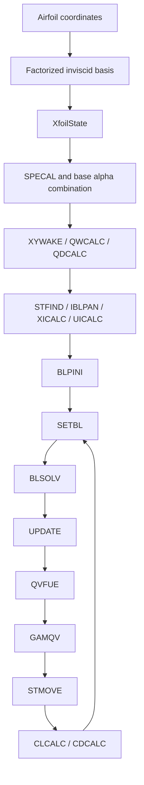

# Faithful XFOIL Solver Architecture

> **Document Status**: Current reference  
> **Primary path**: `crates/rustfoil-xfoil`  
> **Supporting kernels**: `crates/rustfoil-coupling`, `crates/rustfoil-bl`  
> **Last Updated**: 2026-03-14

This page describes the solver path that is now treated as the faithful XFOIL implementation. Older planning-era pages described a broader Rust port strategy, but the current source of truth for viscous operating-point behavior is the `rustfoil-xfoil` crate and the shared kernels it uses underneath.

## What Changed

Recent parity work moved the project away from an abstract "Rust implementation plan" and toward a concrete XFOIL-faithful operating loop:

- The canonical operating-point loop is now in `crates/rustfoil-xfoil/src/oper.rs`.
- Wake geometry, wake velocity ownership, and `DIJ` coupling live on the same path used by the published faithful solver.
- The published order now matches XFOIL's key viscous loop: `SETBL -> BLSOLV -> UPDATE -> QVFUE -> GAMQV -> STMOVE -> force accumulation`.
- Several architecture bugs that mattered for parity were resolved in the faithful path, including signed lower-surface `uinv` handling, wake-to-airfoil `dw` ownership cleanup, and XFOIL-style transition station numbering.

Those changes are reflected in recent Obsidian workstreams and daily notes from 2026-03-10 through 2026-03-13.

## One-Page Mental Model



The important architectural point is that the public faithful solver no longer describes an intended future design. It executes a concrete XFOIL-like sequence against a mutable `XfoilState`, while reusing lower-level coupling and boundary-layer kernels where that helps preserve the original numerics.

## Authoritative Modules

| Area | Current owner | Why it is authoritative |
| --- | --- | --- |
| Public faithful operating point | `crates/rustfoil-xfoil/src/oper.rs` | This is the top-level entrypoint for the faithful viscous loop. |
| Canonical solver state | `crates/rustfoil-xfoil/src/state.rs` | Holds the XFOIL-like panel, wake, and BL row state that the loop mutates. |
| Named panel/state operations | `crates/rustfoil-xfoil/src/state_ops.rs` | Preserves XFOIL routine names such as `SPECAL`, `STFIND`, `IBLPAN`, `XICALC`, `UICALC`, `QVFUE`, `GAMQV`, `STMOVE`, `UESET`, and `DSSET`. |
| Wake geometry and `DIJ` setup | `crates/rustfoil-xfoil/src/wake_panel.rs` | Implements the faithful wake path around `XYWAKE`, `QWCALC`, and `QDCALC`. |
| BL marching | `crates/rustfoil-xfoil/src/march.rs` | Implements the faithful `BLPINI`, `MRCHUE`, and `MRCHDU` path. |
| Coupled Newton assembly | `crates/rustfoil-xfoil/src/assembly.rs` plus `crates/rustfoil-coupling/src/global_newton.rs` | Keeps the XFOIL `SETBL` row structure while reusing a shared global Newton builder. |
| Coupled Newton solve | `crates/rustfoil-xfoil/src/solve.rs` plus `crates/rustfoil-coupling/src/global_newton.rs` | Exposes the `BLSOLV` stage on the faithful path. |
| State update and limiting | `crates/rustfoil-xfoil/src/update.rs` plus `crates/rustfoil-coupling/src/global_newton.rs` | Applies XFOIL-style update, operating correction, and `Ue` preview/update behavior. |
| BL equations and closures | `crates/rustfoil-bl` | Houses the direct ports of `BLVAR`, `BLDIF`, `TRDIF`, `DAMPL`, `TRCHEK2`, `HKIN`, `HSL`, `HST`, `CFL`, `CFT`, `DIL`, `DIT`, and related closures. |
| Force accumulation | `crates/rustfoil-xfoil/src/forces.rs` plus XFOIL-like gamma/wake state | Uses the converged faithful state, not a synthetic post-process shortcut. |

## High-Level XFOIL To Rust Mapping

| XFOIL routine | Faithful Rust owner |
| --- | --- |
| `SPECAL` | `state_ops::specal()` |
| `VISCAL` | `oper::solve_operating_point_from_state()` |
| `XYWAKE` | `wake_panel::xywake()` |
| `QWCALC` | `wake_panel::qwcalc()` |
| `QDCALC` | `wake_panel::qdcalc()` |
| `STFIND` | `state_ops::stfind()` |
| `IBLPAN` | `state_ops::iblpan()` |
| `XICALC` | `state_ops::xicalc()` |
| `UICALC` | `state_ops::uicalc()` |
| `BLPINI` | `march::blpini()` |
| `MRCHUE` | `march::mrchue()` |
| `MRCHDU` | `march::mrchdu()` |
| `SETBL` | `assembly::setbl()` with `GlobalNewtonSystem::build_global_system()` |
| `BLSOLV` | `solve::blsolv()` with `solve_global_system()` |
| `UPDATE` | `update::update()` with `apply_global_updates()` |
| `UESET` | `state_ops::ueset()` and update preview/application helpers |
| `DSSET` | `state_ops::dsset()` |
| `QVFUE` | `state_ops::qvfue()` |
| `GAMQV` | `state_ops::gamqv()` |
| `STMOVE` | `state_ops::stmove()` plus `rustfoil-coupling::stmove` helpers |
| `CLCALC` | `forces::compute_panel_forces_from_gamma()` and `update_force_state()` |
| `CDCALC` | `forces::update_force_state()` using the converged wake state |

## Core Architectural Choices

### 1. `XfoilState` is the canonical owner

The faithful solver now treats `XfoilState` as the authoritative mutable state for the operating point. Shared kernels still work on station slices or canonical views where needed, but the public loop is organized around one XFOIL-like owner rather than around an abstract solver facade.

### 2. Keep XFOIL routine names where they clarify parity

The `rustfoil-xfoil` crate intentionally keeps names like `specal`, `stfind`, `xicalc`, `mrchue`, `setbl`, `blsolv`, and `stmove`. That makes parity work tractable because the Rust call graph can be compared directly with the Fortran call graph.

### 3. Use shared kernels only when they preserve the XFOIL contract

The faithful crate delegates substantial work to `rustfoil-coupling` and `rustfoil-bl`, but only in places where those modules are explicitly treated as implementations of XFOIL contracts. Examples:

- `GlobalNewtonSystem::build_global_system()` for `SETBL`-style assembly.
- `solve_global_system()` for `BLSOLV`-style solution.
- `apply_global_updates()` and `preview_global_update_ue()` for `UPDATE`/`UESET` behavior.
- `blvar()`, `bldif()`, `trdif_full()`, `amplification_rate()`, and `trchek2_full()` for the local BL kernels.

### 4. Preserve XFOIL's sign and indexing conventions

Several of the recent parity fixes were not formula changes, but ownership and convention fixes:

- lower-surface `uinv` must stay signed
- `itran` must follow XFOIL's BL-station numbering, not a Rust row index
- rows that move from wake back to airfoil ownership must clear carried `dw`
- stagnation relocation must happen after `GAMQV`, not before it

These details are now part of the documented architecture, not just debug lore.

## Current Loop Ordering

The faithful path follows this order in `solve_operating_point_from_state()`:

```text
build/factorize geometry
-> SPECAL
-> XYWAKE / QWCALC
-> STFIND / IBLPAN / XICALC / UICALC
-> BLPINI
-> loop:
   SETBL
   BLSOLV
   UPDATE
   QVFUE
   GAMQV
   STMOVE
   force update
```

That order matters. Recent parity work specifically removed an incorrect extra `QVFUE` / `GAMQV` pass after `STMOVE` because XFOIL does not do that.

## Fortran Anchors

These are the main XFOIL routines the faithful architecture mirrors:

- `Xfoil-instrumented/src/xoper.f`: `SPECAL`, `VISCAL`
- `Xfoil-instrumented/src/xpanel.f`: `XYWAKE`, `QWCALC`, `QDCALC`, `STFIND`, `IBLPAN`, `XICALC`, `UICALC`, `QVFUE`, `GAMQV`, `STMOVE`, `UESET`, `DSSET`
- `Xfoil-instrumented/src/xbl.f`: `SETBL`, `MRCHUE`, `MRCHDU`, `UPDATE`
- `Xfoil-instrumented/src/xblsys.f`: `TRCHEK`, `AXSET`, `TRCHEK2`, `BLSYS`, `TESYS`, `BLPRV`, `BLKIN`, `BLVAR`, `BLMID`, `TRDIF`, `BLDIF`, `DAMPL`, `DAMPL2`
- `Xfoil-instrumented/src/xsolve.f`: `BLSOLV`
- `Xfoil-instrumented/src/xfoil.f`: `CLCALC`, `CDCALC`

## Reference Pages

Use the detailed reference pages for routine-level documentation:

- [Faithful Solver Reference Index](./rustfoil-implementation-spec)
- [Faithful Operating Loop](./faithful-operating-loop)
- [Faithful State And Panel Ops](./faithful-state-and-panel-ops)
- [Faithful Marching And Transition](./faithful-marching-and-transition)
- [Faithful Coupled Newton Solve](./faithful-coupled-newton)
- [Faithful BL Kernels](./faithful-bl-kernels)
- [Faithful Forces And Operating Modes](./faithful-forces-and-operating-modes)

## What Is Still Transitional

The architecture is now much closer to XFOIL than the older hybrid path, but the docs should still call out active gaps when they matter. Current examples include:

- some support-layer shared kernels remain more explicit/typed than the original COMMON-block Fortran
- prescribed-alpha operating-variable sensitivity remains a documented area of active parity scrutiny
- some bridge functions exist only to move between canonical row state and the reusable kernel APIs

Those are called out per function in the detailed reference pages rather than hidden behind the top-level overview.
