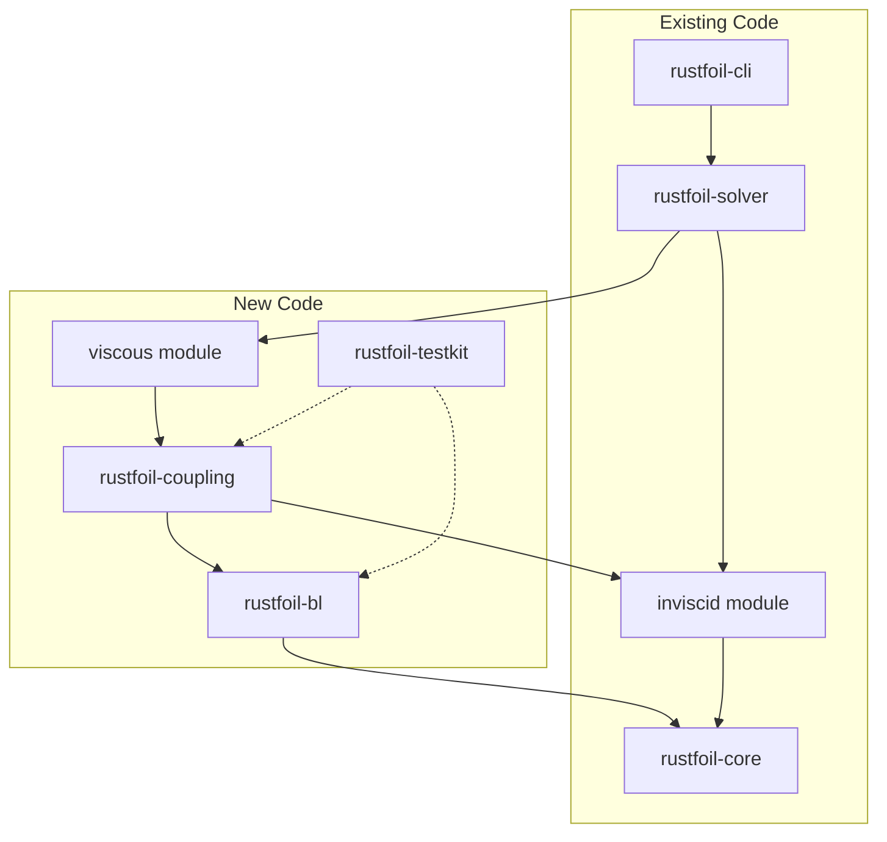

# Viscous Boundary Layer Solver Implementation Plan

## Overview

Implement XFOIL's viscous-inviscid coupling in Rust, building on the existing inviscid solver in `/Users/harry/flexfoil/crates`. Every new Rust function will be unit tested against its FORTRAN counterpart using gfortran-compiled test harnesses.

## Architecture



## FORTRAN Source Files (Reference)

| File | Lines | Key Functions |
|------|-------|---------------|
| Xfoil/src/xblsys.f | 2525 | HKIN, HSL, HST, CFL, CFT, DIL, DIT, HCT, DAMPL, BLVAR, BLDIF, BLSYS |
| Xfoil/src/xbl.f | 1598 | SETBL, MRCHUE, MRCHDU, UPDATE |
| Xfoil/src/xsolve.f | 488 | BLSOLV |
| Xfoil/src/xoper.f | 3161 | VISCAL, CDCALC |
| Xfoil/src/xpanel.f | 1796 | QDCALC, UESET |
| Xfoil/src/BLPAR.INC | 13 | Constants (SCCON, GACON, etc.) |
| Xfoil/src/XBL.INC | 73 | State variables and derivatives |

---

## Phase 1: Test Infrastructure and Closure Functions

### 1.1 Create Test Infrastructure

Create `rustfoil-testkit` crate with FORTRAN test harness compilation:

- **Location**: `/Users/harry/flexfoil/crates/rustfoil-testkit/`
- **Purpose**: Compile FORTRAN test programs, generate reference data, comparison utilities
- **Key files**:
  - `src/lib.rs` - Test utilities and JSON loading
  - `src/fortran_runner.rs` - Compile and run FORTRAN test programs
  - `src/approx.rs` - Floating-point comparison with tolerance
  - `fortran/test_closures.f` - Test harness for all closure functions
  - `fortran/Makefile` - Compile against XFOIL source

### 1.2 Create rustfoil-bl Crate

**Location**: `/Users/harry/flexfoil/crates/rustfoil-bl/`

**Structure**:
```
rustfoil-bl/
├── Cargo.toml
└── src/
    ├── lib.rs
    ├── constants.rs          # BLPAR constants
    ├── state.rs              # BlStation struct
    ├── closures/
    │   ├── mod.rs
    │   ├── hkin.rs           # HKIN (line 2276 of xblsys.f)
    │   ├── hs.rs             # HSL (2327), HST (2388)
    │   ├── cf.rs             # CFL (2354), CFT (2483)
    │   ├── dissipation.rs    # DIL (2290), DIT (2375), DILW (2308)
    │   └── density.rs        # HCT (2514)
    ├── transition.rs         # DAMPL (1981), DAMPL2 (2099), TRCHEK2
    └── equations.rs          # BLVAR (784), BLDIF (1552)
```

### 1.3 Closure Function Implementations

Each function returns value + all partial derivatives (critical for Newton Jacobian):

| Rust Function | FORTRAN | Inputs | Outputs | Test Points |
|---------------|---------|--------|---------|-------------|
| `hkin` | HKIN | H, M² | Hk, ∂Hk/∂H, ∂Hk/∂M² | 400 |
| `hs_laminar` | HSL | Hk, Rθ, M² | Hs, 3 derivatives | 500 |
| `hs_turbulent` | HST | Hk, Rθ, M² | Hs, 3 derivatives | 2000 |
| `cf_laminar` | CFL | Hk, Rθ, M² | Cf, 3 derivatives | 500 |
| `cf_turbulent` | CFT | Hk, Rθ, M² | Cf, 3 derivatives | 2000 |
| `dissipation_laminar` | DIL | Hk, Rθ | Di, 2 derivatives | 500 |
| `dissipation_turbulent` | DIT | Hs, Us, Cf, St | Di, 4 derivatives | 1000 |
| `density_shape` | HCT | Hk, M² | Hc, 2 derivatives | 400 |
| `amplification_rate` | DAMPL | Hk, θ, Rθ | Ax, 3 derivatives | 500 |

### 1.4 FORTRAN Test Harness

Create `fortran/test_closures.f`:
```fortran
      PROGRAM TEST_CLOSURES
      INCLUDE '../../Xfoil/src/BLPAR.INC'
C     Initialize BLPAR constants (from xfoil.f INIT)
      SCCON  = 5.6
      GACON  = 6.70
      GBCON  = 0.75
      GCCON  = 18.0
      DLCON  = 0.9
      CTRCON = 1.8
      CTRCEX = 3.3
      DUXCON = 1.0
      CTCON  = 0.5/(GACON**2 * GBCON)
      CFFAC  = 1.0
      
C     Generate test vectors for each function
      CALL TEST_HKIN()
      CALL TEST_HSL()
      ...
      END
```

---

## Phase 2: Transition Prediction

### 2.1 Transition Module

**File**: `rustfoil-bl/src/transition.rs`

Implement:
- `amplification_rate()` - DAMPL (line 1981)
- `amplification_rate_v2()` - DAMPL2 (line 2099) - modified e^n
- `check_transition()` - TRCHEK2 logic
- `axset()` - AXSET (line 35) - average amplification

### 2.2 FORTRAN Test Harness

Create `fortran/test_transition.f`:
- Test DAMPL at various (Hk, θ, Rθ) combinations
- Test TRCHEK2 with known transition scenarios
- Verify Rθ_crit calculation

---

## Phase 3: BL Equations and State

### 3.1 State Structure

**File**: `rustfoil-bl/src/state.rs`

Match XBL.INC common block structure:
```rust
pub struct BlStation {
    // Primary variables
    pub x: f64,      // Arc length
    pub u: f64,      // Edge velocity
    pub t: f64,      // Momentum thickness θ
    pub d: f64,      // Displacement thickness δ*
    pub s: f64,      // Shear stress coefficient (Cτ)
    pub ampl: f64,   // Amplification factor N
    
    // Derived quantities (computed by blvar)
    pub h: f64,      // Shape factor H = δ*/θ
    pub hk: f64,     // Kinematic Hk
    pub hs: f64,     // Energy Hs
    pub hc: f64,     // Density Hc
    pub rt: f64,     // Rθ
    pub cf: f64,     // Skin friction
    pub di: f64,     // Dissipation
    
    // All partial derivatives (73 values per XBL.INC)
    pub derivs: BlDerivatives,
    
    // Mode flags
    pub is_laminar: bool,
    pub is_wake: bool,
}
```

### 3.2 Equations Module

**File**: `rustfoil-bl/src/equations.rs`

- `blvar()` - BLVAR (line 784) - compute all secondary variables
- `bldif()` - BLDIF (line 1552) - compute residuals and Jacobian blocks

---

## Phase 4: Viscous-Inviscid Coupling

### 4.1 Create rustfoil-coupling Crate

**Location**: `/Users/harry/flexfoil/crates/rustfoil-coupling/`

**Structure**:
```
rustfoil-coupling/
├── Cargo.toml
└── src/
    ├── lib.rs
    ├── dij.rs           # QDCALC - mass defect influence
    ├── newton.rs        # BLSYS (xblsys.f:583), SETBL (xbl.f:21)
    ├── solve.rs         # BLSOLV (xsolve.f:283)
    ├── march.rs         # MRCHUE (xbl.f:542), MRCHDU (xbl.f:875)
    ├── update.rs        # UPDATE (xbl.f:1253), UESET, DSLIM
    └── stagnation.rs    # STFIND, STMOVE
```

### 4.2 DIJ Matrix

**File**: `rustfoil-coupling/src/dij.rs`

QDCALC builds the N×N source panel influence matrix relating mass defect to edge velocity:
```
ΔUe_i = Σ_j DIJ_ij * Δ(Ue*δ*)_j
```

### 4.3 Newton System

**File**: `rustfoil-coupling/src/newton.rs`

Block-tridiagonal structure from BLSYS:
- VA[i]: 3×2 diagonal block at station i
- VB[i]: 3×2 off-diagonal block
- VDEL[i]: 3×1 residual vector
- VS1, VS2: 4×5 sensitivity arrays per XBL.INC

### 4.4 Block Solver

**File**: `rustfoil-coupling/src/solve.rs`

BLSOLV implements block Gaussian elimination with:
- Forward sweep: eliminate sub-diagonal
- Back substitution: solve for updates
- Handle wake coupling to TE

---

## Phase 5: Top-Level Viscous Solver

### 5.1 Extend rustfoil-solver

**Location**: `/Users/harry/flexfoil/crates/rustfoil-solver/src/viscous/`

**Structure**:
```
viscous/
├── mod.rs
├── viscal.rs      # Main iteration loop (VISCAL)
├── forces.rs      # CDCALC - drag calculation
└── config.rs      # ViscousSolverConfig
```

### 5.2 VISCAL Main Loop

Port VISCAL (xoper.f:2886):
1. Initialize BL from stagnation point (MRCHUE)
2. Build Newton system (SETBL)
3. Solve (BLSOLV)
4. Update variables (UPDATE)
5. Check convergence
6. Repeat until converged or max iterations

### 5.3 Public API

```rust
pub fn solve_viscous(
    body: &Body,
    alpha: f64,
    config: &ViscousSolverConfig,
) -> Result<ViscousResult, SolverError>;

pub fn solve_viscous_polar_parallel(
    body: &Body,
    alphas: &[f64],
    config: &ViscousSolverConfig,
) -> Vec<Result<ViscousResult, SolverError>>;
```

---

## Phase 6: CLI Extension

### 6.1 New Commands

Add to `rustfoil-cli/src/main.rs`:

```
rustfoil viscous <FILE> -a <ALPHA> -r <RE> [-m <MACH>] [-n <NCRIT>]
rustfoil viscous-polar <FILE> --alpha <START:END:STEP> -r <RE> [--parallel]
```

### 6.2 Output Formats

- JSON: Full solution with BL state
- CSV: Polar data (alpha, CL, CD, CM, x_tr)
- Human-readable: Summary table

---

## Testing Strategy

### Unit Tests (Per Function)

Every Rust function tested against FORTRAN:

1. **Generate reference data**: Run `fortran/test_*.f` compiled with gfortran
2. **Save as JSON**: `testdata/reference/*.json`
3. **Rust tests**: Load JSON, compare with tolerance

```rust
#[test]
fn test_hkin_matches_fortran() {
    let tests = load_reference("closures/hkin.json");
    for t in tests {
        let result = hkin(t.h, t.msq);
        assert_relative_eq!(result.value, t.hk, epsilon = 1e-10);
        assert_relative_eq!(result.d_h, t.hk_h, epsilon = 1e-10);
        assert_relative_eq!(result.d_msq, t.hk_msq, epsilon = 1e-10);
    }
}
```

### Integration Tests

| Test Case | Inputs | Expected | Tolerance |
|-----------|--------|----------|-----------|
| Flat plate Blasius | Re=1e6, α=0° | H≈2.59 | 5% |
| NACA 0012 low-α | Re=3e6, α=4° | CD≈0.007 | 0.001 |
| NACA 0012 high-α | Re=3e6, α=8° | x_tr≈0.03 | 0.02 |
| Stall detection | Re=3e6, α=14° | CL_max≈1.2 | 0.1 |

### End-to-End XFOIL Comparison

```rust
#[test]
fn compare_polar_with_xfoil() {
    let xfoil = XfoilRunner::new("Xfoil/bin/xfoil");
    let body = Body::from_naca4(12, 160);
    
    for alpha in [-4.0, 0.0, 4.0, 8.0, 12.0] {
        let xfoil_result = xfoil.analyze(&body, alpha, 3e6);
        let rust_result = solve_viscous(&body, alpha, &config).unwrap();
        
        assert_relative_eq!(rust_result.cl, xfoil_result.cl, epsilon = 0.01);
        assert_relative_eq!(rust_result.cd, xfoil_result.cd, epsilon = 0.001);
    }
}
```

---

## File Summary

### New Files to Create

| Crate | File | FORTRAN Reference | Est. Lines |
|-------|------|-------------------|------------|
| rustfoil-testkit | src/lib.rs | - | 100 |
| rustfoil-testkit | src/fortran_runner.rs | - | 150 |
| rustfoil-testkit | src/approx.rs | - | 50 |
| rustfoil-testkit | fortran/test_closures.f | xblsys.f | 300 |
| rustfoil-testkit | fortran/test_transition.f | xblsys.f | 150 |
| rustfoil-testkit | fortran/Makefile | - | 30 |
| rustfoil-bl | src/lib.rs | - | 50 |
| rustfoil-bl | src/constants.rs | BLPAR.INC | 30 |
| rustfoil-bl | src/state.rs | XBL.INC | 150 |
| rustfoil-bl | src/closures/mod.rs | - | 30 |
| rustfoil-bl | src/closures/hkin.rs | HKIN | 50 |
| rustfoil-bl | src/closures/hs.rs | HSL, HST | 200 |
| rustfoil-bl | src/closures/cf.rs | CFL, CFT | 200 |
| rustfoil-bl | src/closures/dissipation.rs | DIL, DIT, DILW | 150 |
| rustfoil-bl | src/closures/density.rs | HCT | 50 |
| rustfoil-bl | src/transition.rs | DAMPL, TRCHEK2 | 300 |
| rustfoil-bl | src/equations.rs | BLVAR, BLDIF | 400 |
| rustfoil-coupling | src/lib.rs | - | 50 |
| rustfoil-coupling | src/dij.rs | QDCALC | 200 |
| rustfoil-coupling | src/newton.rs | BLSYS, SETBL | 400 |
| rustfoil-coupling | src/solve.rs | BLSOLV | 250 |
| rustfoil-coupling | src/march.rs | MRCHUE, MRCHDU | 350 |
| rustfoil-coupling | src/update.rs | UPDATE, UESET | 200 |
| rustfoil-coupling | src/stagnation.rs | STFIND, STMOVE | 100 |
| rustfoil-solver | src/viscous/mod.rs | - | 30 |
| rustfoil-solver | src/viscous/viscal.rs | VISCAL | 300 |
| rustfoil-solver | src/viscous/forces.rs | CDCALC | 100 |
| rustfoil-solver | src/viscous/config.rs | - | 50 |

**Total**: ~4,000 lines of Rust + 500 lines of FORTRAN test harnesses

### Files to Modify

| File | Changes |
|------|---------|
| `/Users/harry/flexfoil/Cargo.toml` | Add rustfoil-bl, rustfoil-coupling, rustfoil-testkit to workspace |
| `/Users/harry/flexfoil/crates/rustfoil-solver/Cargo.toml` | Add dependency on rustfoil-coupling |
| `/Users/harry/flexfoil/crates/rustfoil-cli/src/main.rs` | Add viscous and viscous-polar commands |

---

## Implementation Order (TODO List)

1. **rustfoil-testkit** + FORTRAN harness for closures
2. **rustfoil-bl::constants** (BLPAR)
3. **rustfoil-bl::closures::hkin** + tests
4. **rustfoil-bl::closures::hs** (HSL, HST) + tests
5. **rustfoil-bl::closures::cf** (CFL, CFT) + tests
6. **rustfoil-bl::closures::dissipation** + tests
7. **rustfoil-bl::closures::density** + tests
8. **rustfoil-bl::transition** (DAMPL, TRCHEK2) + tests
9. **rustfoil-bl::state** (BlStation)
10. **rustfoil-bl::equations** (BLVAR, BLDIF) + tests
11. **rustfoil-coupling::dij** (QDCALC) + tests
12. **rustfoil-coupling::newton** (BLSYS, SETBL) + tests
13. **rustfoil-coupling::solve** (BLSOLV) + tests
14. **rustfoil-coupling::march** (MRCHUE, MRCHDU)
15. **rustfoil-coupling::update** (UPDATE, UESET)
16. **rustfoil-solver::viscous** (VISCAL)
17. **rustfoil-cli** viscous commands
18. Integration tests + XFOIL comparison

---

## Key FORTRAN Function Locations

For reference when implementing each function:

### Closures (xblsys.f)
- HKIN: line 2276
- HSL: line 2327
- HST: line 2388
- CFL: line 2354
- CFT: line 2483
- DIL: line 2290
- DIT: line 2375
- DILW: line 2308
- HCT: line 2514
- DAMPL: line 1981
- DAMPL2: line 2099
- BLVAR: line 784
- BLDIF: line 1552
- BLSYS: line 583

### BL Marching (xbl.f)
- SETBL: line 21
- MRCHUE: line 542
- MRCHDU: line 875
- UPDATE: line 1253

### Solver (xsolve.f)
- BLSOLV: line 283

### Main Loop (xoper.f)
- VISCAL: line 2886

### Panel Influence (xpanel.f)
- QDCALC: line 1149
- UESET: line 1758

---

## Prerequisites

- gfortran available at `/opt/homebrew/bin/gfortran`
- XFOIL source at `/Users/harry/flexfoil-boundary-layer/Xfoil/src/`
- Existing inviscid solver at `/Users/harry/flexfoil/crates/`
