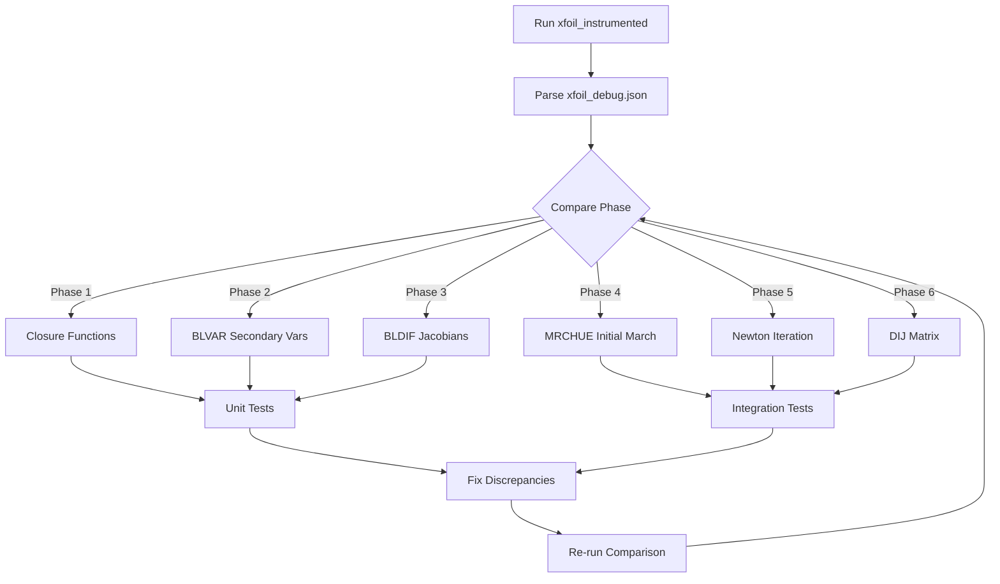

# XFOIL vs RustFoil Comparison Plan

## Overview

This document describes how to systematically compare RustFoil's viscous solver implementation against XFOIL using an instrumented version of XFOIL that outputs detailed JSON debug data.

## Background

RustFoil is a Rust implementation of XFOIL's viscous-inviscid interaction solver. During development, numerical issues were identified:
- Singular Jacobian matrices in the Newton solver
- Non-convergence of the viscous iteration
- Incorrect force coefficients

To debug these issues, we created `xfoil_instrumented` - a modified XFOIL that dumps internal state at each step, enabling direct comparison with RustFoil.

## What is Xfoil-instrumented?

### Location
```
Xfoil-instrumented/
├── src/                  # Modified XFOIL source files
│   ├── xfoil_debug.f     # NEW: JSON output module
│   ├── xblsys.f          # Instrumented: BLVAR, BLDIF, closures
│   ├── xbl.f             # Instrumented: MRCHUE, UPDATE
│   ├── xoper.f           # Instrumented: VISCAL
│   ├── xpanel.f          # Instrumented: QDCALC
│   └── xsolve.f          # Instrumented: BLSOLV
├── bin/
│   ├── Makefile
│   └── xfoil_instrumented  # Built binary
└── README.md
```

### What It Captures

The instrumented XFOIL outputs JSON events for:

| Subroutine | What It Dumps | RustFoil Equivalent |
|------------|---------------|---------------------|
| `VISCAL` | Iteration start/end, α, Re, M, Ncrit, CL, CD, CM, residuals | `solve_viscous()` in `viscal.rs` |
| `BLVAR` | BL secondary variables: H, Hk, Hs, Cf, Cd, Rθ, Us, Cq, De + inputs | `blvar()` in `equations.rs` |
| `BLDIF` | Jacobian matrices VS1[4,5], VS2[4,5], residuals VSREZ[4] | `bldif()` in `equations.rs` |
| `MRCHUE` | Initial march state per station: x, Ue, θ, δ*, Cτ, Hk, Cf | `march_fixed_ue()` in `march.rs` |
| `UPDATE` | Newton deltas applied: Δθ, Δδ*, ΔUe, relaxation | `update_bl_variables()` in `update.rs` |
| `QDCALC` | DIJ influence matrix (sample) | `build_dij_matrix()` in `dij.rs` |
| `BLSOLV` | Newton system size | `solve_bl_system()` in `solve.rs` |
| `HSL/CFL` | Laminar closure functions + derivatives | `hsl()`, `cfl()` in closures |
| `HKIN` | Kinematic shape parameter H → Hk | `hkin()` in closures |
| `DAMPL` | Amplification rate for transition | `dampl()` in closures |

### JSON Output Format

```json
{
  "events": [
    {
      "call_id": 1,
      "subroutine": "VISCAL",
      "iteration": 1,
      "alpha_rad": 0.0698,
      "reynolds": 3000000.0,
      "mach": 0.0,
      "ncrit": 9.0
    },
    {
      "call_id": 5,
      "subroutine": "BLVAR",
      "iteration": 1,
      "side": 1,
      "ibl": 3,
      "flow_type": 1,
      "input": {
        "x": 0.05,
        "u": 1.02,
        "theta": 0.00012,
        "delta_star": 0.00031,
        "ctau": 0.03,
        "ampl": 0.0
      },
      "output": {
        "H": 2.58,
        "Hk": 2.58,
        "Hs": 1.62,
        "Cf": 0.0045,
        "Cd": 0.0012,
        "Rtheta": 1234.5,
        "Us": 0.22,
        "Cq": 0.07,
        "De": 0.00014
      }
    },
    {
      "call_id": 7,
      "subroutine": "BLDIF",
      "side": 1,
      "ibl": 3,
      "flow_type": 1,
      "VS1": [[...], [...], [...], [...]],
      "VS2": [[...], [...], [...], [...]],
      "VSREZ": [0.001, -0.002, 0.0005, 0.0]
    }
  ]
}
```

## Building and Running Xfoil-instrumented

### Build
```bash
cd Xfoil-instrumented/bin
make
```

### Run Standard Test Case
```bash
echo "NACA 0012
OPER
VISC 3000000
ITER 10
ALFA 4

QUIT" | ./xfoil_instrumented

# Output: xfoil_debug.json (in current directory)
```

### Expected Output
For NACA 0012 at α=4°, Re=3M:
- **CL**: ~0.443
- **CD**: ~0.00618
- **Events**: ~25,000+ per run

## Comparison Strategy

### Phase 1: Closure Function Verification

Compare individual closure functions with identical inputs.

**XFOIL Events to Extract:**
- `HKIN`: H, Msq → Hk
- `HSL`: Hk, Rθ, Msq → Hs
- `CFL`: Hk, Rθ, Msq → Cf
- `DAMPL`: Hk, θ, Rθ → Ax

**RustFoil Test:**
```rust
#[test]
fn test_hkin_matches_xfoil() {
    // From xfoil_debug.json HKIN event
    let h = 2.2;
    let msq = 0.0;
    let (hk, hk_h, hk_msq) = hkin(h, msq);
    
    // XFOIL values
    assert!((hk - 2.2).abs() < 1e-6);
    assert!((hk_h - 1.0).abs() < 1e-6);
}
```

### Phase 2: BLVAR Comparison

Compare secondary BL variables computed from primary variables.

**Extract from XFOIL:**
```python
blvar_events = [e for e in events if e['subroutine'] == 'BLVAR']
for ev in blvar_events[:10]:
    print(f"Station {ev['ibl']}: input={ev['input']}, output={ev['output']}")
```

**Compare with RustFoil:**
```rust
fn compare_blvar(station: &BlStation, xfoil_event: &JsonValue) {
    let input = &xfoil_event["input"];
    let output = &xfoil_event["output"];
    
    // Set up station with XFOIL inputs
    station.x = input["x"].as_f64();
    station.ue = input["u"].as_f64();
    station.theta = input["theta"].as_f64();
    station.delta_star = input["delta_star"].as_f64();
    
    // Compute secondary variables
    blvar(station, flow_type);
    
    // Compare outputs
    assert_close(station.h, output["H"].as_f64());
    assert_close(station.hk, output["Hk"].as_f64());
    assert_close(station.cf, output["Cf"].as_f64());
}
```

### Phase 3: BLDIF Jacobian Comparison

This is **critical** - the Jacobian matrices determine Newton convergence.

**XFOIL Jacobian Structure:**
- `VS1[4,5]`: Derivatives at station 1 (upstream)
- `VS2[4,5]`: Derivatives at station 2 (current)
- Rows: [amplification/Cτ, momentum, shape parameter, Ue constraint]
- Columns: [Cτ/n, θ, δ*, Ue, x]

**Comparison Script:**
```python
import json
import numpy as np

def compare_jacobians(xfoil_json, rustfoil_output):
    """Compare BLDIF Jacobian matrices."""
    with open(xfoil_json) as f:
        data = json.load(f)
    
    bldif_events = [e for e in data['events'] if e['subroutine'] == 'BLDIF']
    
    for ev in bldif_events:
        vs1_xfoil = np.array(ev['VS1'])
        vs2_xfoil = np.array(ev['VS2'])
        vsrez_xfoil = np.array(ev['VSREZ'])
        
        # Get corresponding RustFoil output
        # ... compare matrices element by element
        
        # Check for zeros that shouldn't be zero
        print(f"Station {ev['ibl']}: VS1 column 2 (δ* derivs):")
        print(f"  XFOIL: {vs1_xfoil[:, 2]}")
        # NOTE: Previously RustFoil had zeros here causing singular matrices
```

### Phase 4: Initial March (MRCHUE) Comparison

The initial BL march sets up the starting point for Newton iteration.

**Extract MRCHUE Events:**
```python
mrchue_events = [e for e in events if e['subroutine'] == 'MRCHUE']
for ev in mrchue_events:
    print(f"Side {ev['side']}, IBL {ev['ibl']}:")
    print(f"  x={ev['x']:.6f}, Ue={ev['Ue']:.6f}")
    print(f"  θ={ev['theta']:.6e}, δ*={ev['delta_star']:.6e}")
    print(f"  Hk={ev['Hk']:.4f}, Cf={ev['Cf']:.6f}")
```

**RustFoil Comparison:**
```rust
// After march_fixed_ue() in RustFoil
for (i, station) in stations.iter().enumerate() {
    println!("Station {}: x={}, ue={}, theta={}, delta_star={}, hk={}",
             i, station.x, station.ue, station.theta, station.delta_star, station.hk);
}
```

### Phase 5: Newton Iteration Comparison

Compare UPDATE events to see how deltas are applied.

**Key Questions:**
1. Are the Newton deltas similar in magnitude?
2. Is the relaxation factor similar?
3. Does the residual decrease at similar rates?

### Phase 6: DIJ Matrix Comparison

The influence matrix couples BL displacement to edge velocity.

**XFOIL Structure:**
- DIJ[i,j] = ∂Ue_i/∂(δ*·Ue)_j
- Includes airfoil panels and wake panels
- Diagonal terms are non-zero (self-influence)

**RustFoil Location:** `crates/rustfoil-coupling/src/dij.rs`

## RustFoil Code Locations

| Component | File | Function |
|-----------|------|----------|
| Main solver | `crates/rustfoil-solver/src/viscous/viscal.rs` | `solve_viscous()` |
| BL variables | `crates/rustfoil-bl/src/equations.rs` | `blvar()` |
| Jacobians | `crates/rustfoil-bl/src/equations.rs` | `bldif()` |
| Initial march | `crates/rustfoil-coupling/src/march.rs` | `march_fixed_ue()` |
| Newton system | `crates/rustfoil-coupling/src/newton.rs` | `BlNewtonSystem` |
| Block solve | `crates/rustfoil-coupling/src/solve.rs` | `solve_bl_system()` |
| Update | `crates/rustfoil-coupling/src/update.rs` | `update_bl_variables()` |
| DIJ matrix | `crates/rustfoil-coupling/src/dij.rs` | `build_dij_matrix()` |
| Closures | `crates/rustfoil-bl/src/closures/` | `hkin()`, `hsl()`, `cfl()`, etc. |

## Known Issues in RustFoil (Pre-Comparison)

1. **Singular Jacobian** (FIXED): Column 2 (δ* derivatives) was missing in `bldif()`
2. **DIJ diagonal** (FIXED): Self-influence terms were zero
3. **March initialization**: May have different starting values than XFOIL
4. **Non-convergence**: Newton iteration doesn't converge to XFOIL tolerance

## Comparison Workflow



## Suggested Comparison Script

Create `scripts/compare_xfoil_rustfoil.py`:

```python
#!/usr/bin/env python3
"""Compare XFOIL instrumented output with RustFoil."""

import json
import argparse
import numpy as np

def load_xfoil_events(json_path):
    with open(json_path) as f:
        return json.load(f)['events']

def filter_events(events, subroutine, iteration=None, side=None, ibl=None):
    """Filter events by criteria."""
    result = [e for e in events if e['subroutine'] == subroutine]
    if iteration is not None:
        result = [e for e in result if e.get('iteration') == iteration]
    if side is not None:
        result = [e for e in result if e.get('side') == side]
    if ibl is not None:
        result = [e for e in result if e.get('ibl') == ibl]
    return result

def summarize_events(events):
    """Print summary of event types."""
    counts = {}
    for e in events:
        sub = e['subroutine']
        counts[sub] = counts.get(sub, 0) + 1
    
    print("Event Summary:")
    for k, v in sorted(counts.items(), key=lambda x: -x[1]):
        print(f"  {k}: {v}")

def compare_blvar(xfoil_event, rustfoil_values):
    """Compare BLVAR outputs."""
    xf = xfoil_event['output']
    rf = rustfoil_values
    
    fields = ['H', 'Hk', 'Hs', 'Cf', 'Cd', 'Rtheta']
    for field in fields:
        xf_val = xf.get(field, 0)
        rf_val = rf.get(field.lower(), 0)
        diff = abs(xf_val - rf_val)
        rel_diff = diff / abs(xf_val) if xf_val != 0 else diff
        status = "✓" if rel_diff < 0.01 else "✗"
        print(f"  {field}: XFOIL={xf_val:.6e}, RustFoil={rf_val:.6e}, diff={rel_diff*100:.2f}% {status}")

def compare_jacobian(xfoil_event):
    """Analyze Jacobian from BLDIF event."""
    vs1 = np.array(xfoil_event['VS1'])
    vs2 = np.array(xfoil_event['VS2'])
    
    print(f"  VS1 shape: {vs1.shape}")
    print(f"  VS2 shape: {vs2.shape}")
    
    # Check for problematic zeros
    for col in range(vs1.shape[1]):
        if np.allclose(vs1[:3, col], 0):
            print(f"  WARNING: VS1 column {col} is all zeros (rows 0-2)")
        if np.allclose(vs2[:3, col], 0):
            print(f"  WARNING: VS2 column {col} is all zeros (rows 0-2)")
    
    # Check 3x3 submatrix singularity
    va = vs1[:3, :3]
    try:
        det = np.linalg.det(va)
        print(f"  VS1[0:3,0:3] determinant: {det:.6e}")
        if abs(det) < 1e-10:
            print("  WARNING: Near-singular VA block!")
    except:
        pass

def main():
    parser = argparse.ArgumentParser()
    parser.add_argument('xfoil_json', help='Path to xfoil_debug.json')
    parser.add_argument('--phase', type=int, default=0, help='Comparison phase (1-6)')
    args = parser.parse_args()
    
    events = load_xfoil_events(args.xfoil_json)
    summarize_events(events)
    
    if args.phase == 1:
        print("\n=== Phase 1: Closure Functions ===")
        hkin_events = filter_events(events, 'HKIN')[:5]
        for ev in hkin_events:
            print(f"HKIN: H={ev['H']:.4f}, Msq={ev['Msq']:.4f} -> Hk={ev['Hk']:.4f}")
    
    elif args.phase == 3:
        print("\n=== Phase 3: Jacobian Analysis ===")
        bldif_events = filter_events(events, 'BLDIF', iteration=1)[:5]
        for ev in bldif_events:
            print(f"\nBLDIF side={ev['side']}, ibl={ev['ibl']}, type={ev['flow_type']}:")
            compare_jacobian(ev)

if __name__ == '__main__':
    main()
```

## Next Steps

1. **Run comparison script** on existing `xfoil_debug.json`
2. **Add RustFoil JSON output** - mirror the XFOIL debug format
3. **Create unit tests** for each closure function using XFOIL values
4. **Fix discrepancies** found in comparison
5. **Iterate** until RustFoil matches XFOIL within tolerance

## Success Criteria

- [ ] All closure functions match XFOIL within 0.1%
- [ ] BLVAR outputs match within 1%
- [ ] BLDIF Jacobians have same structure (non-zero pattern)
- [ ] Initial march produces similar θ, δ* profiles
- [ ] Newton iteration converges to similar residual
- [ ] Final CL, CD within 1% of XFOIL

## References

- Original XFOIL source: `Xfoil/src/`
- Instrumented XFOIL: `Xfoil-instrumented/`
- RustFoil viscous solver: `crates/rustfoil-solver/src/viscous/`
- RustFoil BL equations: `crates/rustfoil-bl/src/`
- RustFoil coupling: `crates/rustfoil-coupling/src/`
